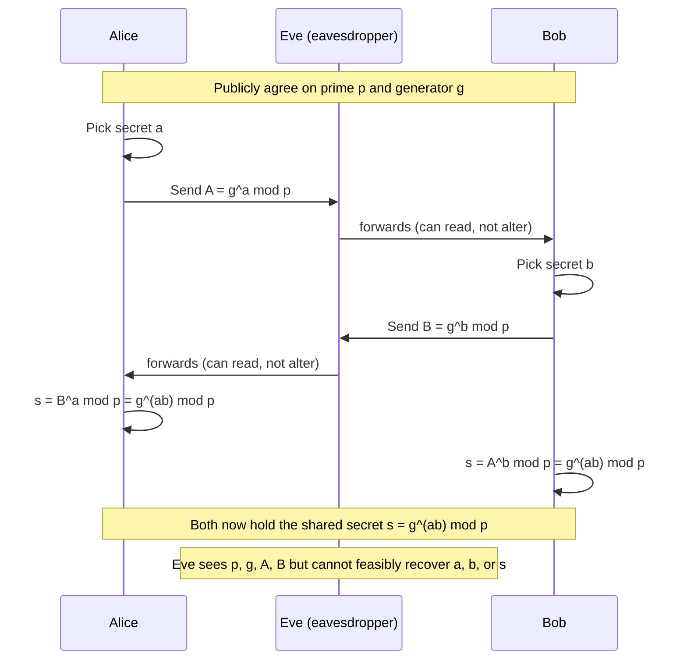
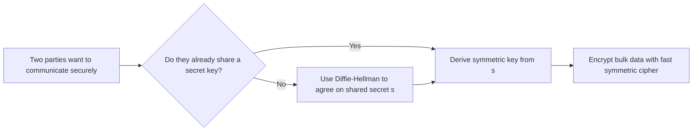

Before 1976, essentially all cryptography was **symmetric**: the same secret key was used to both encrypt and decrypt a message. This works fine once two parties already share a key, but it creates a serious practical problem: how do you get that shared key to both parties in the first place, especially if they've never met and can't use a trusted courier?

This is called the **key distribution problem**. In large networks, it scales badly. If every pair of $n$ users needs their own shared secret key, the total number of keys required is

$$\binom{n}{2} = \frac{n(n-1)}{2}$$

For a network of just $10{,}000$ people, that's already roughly $50$ million distinct keys to generate, distribute, and protect. This grows quadratically, so it becomes completely unmanageable at internet scale.

In 1976, Whitfield Diffie and Martin Hellman published _New Directions in Cryptography_, proposing a fundamentally different approach: split a key into two parts, one public and one private, so two people can establish a shared secret over an insecure channel, without ever having met or exchanged anything secret beforehand.

This paper is widely considered the starting point of modern public-key cryptography, even though the specific encryption scheme most people associate with it today (RSA) came a year later, in 1977.

## The Core Idea: Public Key Cryptography

The paper's central proposal was to use a **key pair** instead of a single shared key:

- A **public key**, which can be shared with anyone, even published openly.
- A **private key**, which is kept secret by its owner and never shared.

Anything encrypted with someone's public key can only be decrypted with the matching private key. Two strangers can then communicate securely without ever exchanging a secret in advance, since the sender only needs the recipient's public key, which doesn't need to be protected at all.

This was radical at the time, since cryptographers had always assumed anything used to encrypt a message had to be kept secret. Diffie and Hellman showed this wasn't necessary, as long as the mathematical relationship between the two keys had a specific structure, described below.

## Mathematical Building Blocks

### Modular arithmetic

Everything in this scheme happens inside **modular arithmetic**. Two integers $a$ and $b$ are said to be _congruent modulo_ $p$ if they leave the same remainder when divided by $p$:

$$a \equiv b \pmod{p} \iff p \mid (a-b)$$

Modular exponentiation, computing $g^a \bmod p$, is what everything below is built on. Even though $a$ can be an enormous number, $g^a \bmod p$ can be computed efficiently using **repeated squaring**: instead of multiplying $g$ by itself $a$ times, you repeatedly square and reduce modulo $p$ at each step, which takes roughly $\log_2 a$ multiplications instead of $a$ multiplications. This is what makes the "forward direction" of the scheme fast even for keys hundreds of digits long.

### Groups, generators, and order

The set of nonzero integers modulo a prime $p$, under multiplication, forms a mathematical structure called a **group**, written $\mathbb{Z}_p^{*} = {1, 2, \dots, p-1}$. This group has $p - 1$ elements.

An element $g$ is called a **generator** (or **primitive root**) of this group if repeatedly multiplying it by itself produces every element of the group before cycling back to $1$. Formally, the **order** of $g$ is the smallest positive integer $k$ such that

$$g^k \equiv 1 \pmod{p}$$

If that order $k$ equals $p-1$, then $g$ is a generator, and the sequence

$$g^1, g^2, g^3, \dots, g^{p-1} \pmod p$$

produces every nonzero residue mod $p$ exactly once, in some scrambled order. This scrambling is precisely what makes the scheme secure: the outputs look essentially random even though they're produced by a completely deterministic rule.

This also relies on **Fermat's Little Theorem**, which states that for any prime $p$ and any integer $g$ not divisible by $p$:

$$g^{p-1} \equiv 1 \pmod{p}$$

This guarantees the group always "wraps around" after at most $p-1$ steps, which is why the order of any element must divide $p - 1$.

### One-way functions and trapdoors, formally

A function $f$ is called **one-way** if it's easy to compute in one direction, but computationally infeasible to invert in the other. Formally, $f$ is easy to compute if there's an efficient (polynomial-time) algorithm for $f(x)$ given $x$, but for essentially all $y$ in the range of $f$, there is no known efficient algorithm that finds an $x$ such that $f(x) = y$.

Modular exponentiation is believed to be exactly this kind of function:

$$f(a) = g^a \bmod p \quad \text{easy to compute}$$ $$f^{-1}(g^a \bmod p) = a \quad \text{believed hard to compute}$$

A **trapdoor one-way function** is a one-way function that becomes easy to invert given one extra piece of secret information, the trapdoor. In public key systems generally, the public key lets anyone compute $f$ (the "easy direction," e.g. encryption), while the private key is the trapdoor that makes $f^{-1}$ easy again for the intended recipient only.

## The Diffie-Hellman Key Exchange

The protocol lets two parties, conventionally called Alice and Bob, agree on a shared secret over a public channel, even with an eavesdropper, Eve, watching every message.

**Setup (public, known to everyone including Eve):**

$$p = \text{a large prime}, \qquad g = \text{a generator of } \mathbb{Z}_p^{*}$$

**Steps:**

1. Alice picks a secret random integer $a \in {1, \dots, p-2}$, computes

$$A = g^a \bmod p$$

and sends $A$ to Bob.

2. Bob picks a secret random integer $b \in {1, \dots, p-2}$, computes

$$B = g^b \bmod p$$

and sends $B$ to Alice.

3. Alice computes the shared secret:

$$s = B^a \bmod p = (g^b)^a \bmod p = g^{ba} \bmod p$$

4. Bob computes the shared secret:

$$s = A^b \bmod p = (g^a)^b \bmod p = g^{ab} \bmod p$$

Since exponents commute, $g^{ab} \equiv g^{ba} \pmod p$, so both arrive at the exact same value $s = g^{ab} \bmod p$, without either of them ever transmitting $a$, $b$, or $s$ itself.

### Worked numeric example (small, insecure numbers, for intuition only)

Real Diffie-Hellman uses primes hundreds of digits long. The numbers below are small enough to compute by hand, purely to show the mechanics; they would be trivially breakable in reality.

Let $p = 23$ and $g = 5$ (a generator of $\mathbb{Z}_{23}^{*}$).

- Alice picks $a = 6$, computes $A = 5^6 \bmod 23 = 15{,}625 \bmod 23 = 8$. She sends $A = 8$.
- Bob picks $b = 15$, computes $B = 5^{15} \bmod 23 = 19$. He sends $B = 19$.
- Alice computes $s = B^a \bmod 23 = 19^6 \bmod 23 = 2$.
- Bob computes $s = A^b \bmod 23 = 8^{15} \bmod 23 = 2$.

Both land on $s = 2$. Eve, watching the channel, only ever sees $p = 23$, $g = 5$, $A = 8$, $B = 19$. To find the shared secret, she would need to recover $a$ or $b$ from $A$ or $B$, which is exactly the discrete logarithm problem described next. With numbers this small it's easy to brute-force; with a 2048-bit prime, it isn't.

## Why It's Secure: The Discrete Logarithm Problem

The **discrete logarithm problem (DLP)** is defined as: given $p$, $g$, and $A = g^a \bmod p$, find $a$.

Written using logarithm notation:

$$a = \log_g A \pmod p$$

This looks like an ordinary logarithm, but computing it modulo a large prime is believed to be computationally infeasible, unlike computing an ordinary real-number logarithm, which is easy. The best known classical algorithms for solving DLP over $\mathbb{Z}_p^{*}$, such as the **index calculus method**, run in **sub-exponential time**, roughly

$$L_p!\left[\tfrac{1}{3}, c\right] = \exp!\left(c,(\ln p)^{1/3}(\ln \ln p)^{2/3}\right)$$

for some constant $c$. This is faster than brute-force (which would take exponential time, roughly $p$ operations), but still far too slow to be practical when $p$ has hundreds of digits, which is why key sizes of 2048 bits or more are recommended today.

The exact assumption the security of the protocol relies on has a name: the **Computational Diffie-Hellman (CDH) assumption**, which states that given $g$, $g^a \bmod p$, and $g^b \bmod p$, it's computationally infeasible to compute $g^{ab} \bmod p$ without knowing $a$ or $b$. A closely related, slightly stronger assumption, the **Decisional Diffie-Hellman (DDH) assumption**, states that it's infeasible to even distinguish $g^{ab} \bmod p$ from a completely random group element, given the same information. DDH is used to prove stronger security properties for systems built on top of Diffie-Hellman.

It's worth being precise here: none of this is proven to be hard in the mathematical sense. Nobody has proven $\mathrm{P} \neq \mathrm{NP}$, and nobody has proven DLP requires exponential time. The security rests on the fact that despite decades of dedicated effort by mathematicians and cryptographers, no efficient algorithm has been found. This is a recurring theme in cryptography: security is almost always based on well-studied problems being hard _in practice_, not proven hard _in theory_.

## Public Key Encryption vs. Symmetric Cryptography

The paper's contribution went beyond key exchange alone. It laid the theoretical foundation for **public key (asymmetric) cryptography** as a general concept, distinct from symmetric cryptography:

- **Symmetric cryptography**: one key $k$, shared by both parties, used for both $E_k(m)$ (encryption) and $D_k(c)$ (decryption), where $D_k(E_k(m)) = m$. Computationally cheap, but requires a secure channel to share $k$ beforehand.
- **Asymmetric cryptography**: a key pair $(k_{\text{pub}}, k_{\text{priv}})$, where $D_{k_{\text{priv}}}(E_{k_{\text{pub}}}(m)) = m$. The public key never needs to be kept secret, which solves the key distribution problem, but the underlying math (like modular exponentiation with large numbers) is far more computationally expensive than symmetric operations.

In practice, most real systems combine both: asymmetric cryptography (often Diffie-Hellman itself) to agree on a temporary symmetric key, then symmetric cryptography for the actual bulk data, since it's orders of magnitude faster. This hybrid approach underlies protocols like TLS, which secures most web traffic today.

## Digital Signatures

The paper also introduced the conceptual groundwork for **digital signatures**, even though a full working signature scheme wasn't presented until RSA the following year. The underlying idea, stated generally: if a private key can produce some value that only its owner could feasibly compute, and the matching public key can verify that this value was genuinely produced using that private key, then this achieves authenticity and nonrepudiation, the same properties introduced in Part 1 under the AAA framework.

This ties directly back to the trapdoor function idea above. A digital signature is essentially a trapdoor function used in reverse: the private key performs the "hard direction" (something infeasible without the secret), producing a signature that anyone holding the public key can then verify by running the "easy direction" and checking the result matches.

## Significance and Impact

_New Directions in Cryptography_ is widely regarded as one of the most influential papers in the history of computer security. Before it, secure communication between two strangers over an untrusted channel, with no prior shared secret, was considered essentially impossible. The paper showed this wasn't true, and it opened the door to:

- Secure key exchange over public networks, without a trusted courier or prior contact.
- Public key encryption schemes like RSA, published the following year, which rely on a different hard problem (factoring large composite numbers) rather than the discrete logarithm.
- Digital signatures, enabling authenticity and nonrepudiation at scale.
- The security infrastructure underlying most of the modern internet, including HTTPS, SSH, and secure messaging, most of which still use variants of Diffie-Hellman (commonly elliptic-curve variants like ECDH today) for key exchange.

It's also worth knowing a similar idea was independently developed a few years earlier by British intelligence researchers, James Ellis, Clifford Cocks, and Malcolm Williamson at GCHQ, but their work was classified and only made public decades later. Diffie and Hellman's paper remains the version that was public first and shaped the field as it's known today.

## Note on the Basic Protocol's Weakness

The plain version of the exchange described above has no way for Alice or Bob to verify who they're actually talking to. Eve doesn't need to break the discrete logarithm problem at all, she can simply insert herself between Alice and Bob, running the protocol separately with each of them and relaying (and reading) everything that passes through. This is called a **man-in-the-middle attack**, and it's a limitation of authentication, not of the underlying math. Real systems fix this by combining Diffie-Hellman with digital signatures or certificates, so each party can cryptographically prove their identity before or during the exchange, which is exactly what protocols like TLS do in practice.