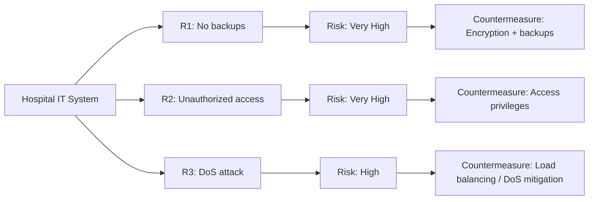

### Table of Contents
- [[#Primary Security Goals (the CIA Triad)|Primary Security Goals (the CIA Triad)]]
	- [[#Primary Security Goals (the CIA Triad)#Confidentiality|Confidentiality]]
	- [[#Primary Security Goals (the CIA Triad)#Integrity|Integrity]]
	- [[#Primary Security Goals (the CIA Triad)#Availability|Availability]]
- [[#Other Commonly Listed Security Goals|Other Commonly Listed Security Goals]]
	- [[#Other Commonly Listed Security Goals#AAA|AAA]]
	- [[#Other Commonly Listed Security Goals#Privacy|Privacy]]
- [[#Risks|Risks]]
	- [[#Risks#Material vs. Immaterial Harm|Material vs. Immaterial Harm]]
	- [[#Risks#Risk Management|Risk Management]]
	- [[#Risks#Asset|Asset]]
	- [[#Risks#Threats|Threats]]
	- [[#Risks#Vulnerabilities|Vulnerabilities]]
	- [[#Risks#Threats, Vulnerabilities, and Attacks: Putting It Together|Threats, Vulnerabilities, and Attacks: Putting It Together]]
	- [[#Risks#Network Attacks|Network Attacks]]
	- [[#Risks#Possible Attackers|Possible Attackers]]
	- [[#Risks#Motivation for Attackers|Motivation for Attackers]]
	- [[#Risks#Policy and Mechanism|Policy and Mechanism]]
	- [[#Risks#Goals of Security Mechanisms|Goals of Security Mechanisms]]
	- [[#Risks#Assumptions and Trust|Assumptions and Trust]]
	- [[#Risks#Assurance|Assurance]]
	- [[#Risks#Operational Issues|Operational Issues]]
	- [[#Risks#Human Issues|Human Issues]]
---

Security is the protection of a computer, network, or entire system from intrusion, unauthorized modification, and other harm.

The security of a system, application, or protocol is always relative to a defined set of properties. A system isn't "secure" in an absolute sense; it's secure with respect to specific goals (confidentiality, integrity, availability, etc.) and specific threats.

Cybersecurity draws on many areas beyond pure technology, including law, psychology, economics, and organizational behavior. This is what makes it both challenging and interesting to work in.

---

## Primary Security Goals (the CIA Triad)

### Confidentiality

Confidentiality means only authorized people or systems can access certain information.

**Why it matters:**

- Legal requirements, such as GDPR, require organizations to protect personal data.
- It prevents attackers from gaining access to sensitive information.
- It's often the property people care about most instinctively (e.g., not wanting private messages read by strangers).

We're usually protecting either personal data or organizational data that shouldn't reach the public. For example, when you message a friend, you don't want anyone else to read it. This is why apps like WhatsApp use end-to-end encryption: only the sender and receiver can read the message, not even the app provider.

Confidentiality builds trust: people use a system because they believe it keeps their data away from anyone not authorized to see it.

**Tools used to achieve confidentiality:**

_Encryption_ You can't trust a network, since anyone can intercept traffic on it. Encryption protects a message by scrambling it mathematically so that anyone who intercepts it can't understand it. The recipient uses a matching key or algorithm to reverse the process and recover the original message.

_Access Control_ Restricting who can access specific data, based on permissions, roles, time of access, or other conditions. For example, only HR staff can view salary records, and only during working hours.

_Authentication_ The process of verifying that someone is who they claim to be, before granting access. Common methods include passwords, biometrics, and security tokens.

_Authorization_ Once someone is authenticated, authorization determines what they're allowed to do. Authentication answers "who are you?", authorization answers "what can you do?"

_Physical Security_ Protecting the physical hardware and premises where sensitive data lives, so that confidentiality can't simply be bypassed by walking up to a machine. Examples:

- TPM (Trusted Platform Module) chips and other secure hardware that store cryptographic keys.
- Biometric locks like fingerprint or face recognition.
- Security guards, alarms, and locked server rooms at facilities storing sensitive data.

### Integrity

Integrity means preventing unauthorized modification of information or resources.

- **Data integrity** concerns the content of information: has it been changed without permission?
- **Origin integrity** concerns the source of information: did it really come from who it claims to come from? This overlaps with authenticity, since verifying the origin requires authenticating the source.

In many commercial systems, integrity matters more than confidentiality. A bank cares more about nobody tampering with account balances than about those balances staying secret.

**Hashing** When sending a file, you can generate a hash: a fixed-length string produced by running the file through a mathematical function (like SHA-256). Even a tiny change to the file produces a completely different hash. The hash acts as a fingerprint you can use to confirm the file wasn't altered.

When a file is downloaded or transferred, you hash the received copy and compare it to the original, known hash. If they match, the file wasn't tampered with in transit.

Performance also matters. Hashing large files or doing it constantly costs processing time, so systems often use hybrid approaches, such as hashing only chunks of data or combining hashing with lighter checks, to balance security and speed.

**Prevention vs. detection mechanisms:**

- _Prevention mechanisms_ stop unauthorized modification before it happens, for example, preventing a bank's janitor from editing account records. They don't stop someone with legitimate access from misusing it, like a bank manager transferring funds to their own account.
- _Detection mechanisms_ don't stop unauthorized changes, but they catch them after the fact, so both scenarios above can be identified and corrected.

### Availability

Availability means systems and information are accessible to authorized users whenever they need them.

Attacks that target availability are called **Denial-of-Service (DoS)** attacks. A well-known example was Xbox Live going down on Christmas morning due to an attack, disrupting the day for millions of users.

Availability is one of the hardest properties to guarantee, and most security research historically has focused on confidentiality and integrity instead, largely because those two are comparatively easy: simply unplug the system and lock it in a vault, and both are guaranteed (at the cost of making the system useless). Availability doesn't have that shortcut, since the whole point is that the system stays usable.

**Why it's difficult:**

- It's hard to distinguish a real DoS attack from a normal spike in legitimate traffic.
- Availability can be affected by factors outside the security model entirely, for example, a construction crew accidentally cutting a power or network cable.

**Load balancing** is one common defense: distributing incoming traffic across multiple servers so no single machine is overwhelmed. This helps absorb both legitimate traffic spikes and some attack traffic, and it also means a failure in one server doesn't take the whole system down.

---

## Other Commonly Listed Security Goals

### AAA

A framework often used alongside the CIA triad:

**Assurance** How much trust can be placed in a system, and how that trust is established and maintained. Hard to measure precisely, but essential in practice: can we trust that the operating system is free of bugs, and can the system trust that a user really is who they claim to be?

Tools that support assurance:

- _Policies_: formal rules defining how a system should be used and secured.
- _Permissions_: specific rights granted to users or processes.
- _Protections_: technical safeguards (firewalls, sandboxing, etc.) that enforce policies and permissions.

**Authenticity** The ability to confirm that a statement, policy, or permission genuinely came from the person or system it claims to come from. Authenticity can be thought of as authentication combined with integrity.

The main tool for authenticity is the **digital signature**. Similar to the hashing described earlier, a digital signature lets a person or system cryptographically commit to a document, proving both who created it and that it hasn't been altered since. This provides **nonrepudiation**: the property that someone can't later deny having issued a statement or taken an action, since their signature ties them to it.

**Anonymity** The property that actions or transactions can't be traced back to a specific individual. This is effectively the opposite of authenticity.

Tools used for anonymity:

- _Proxies_: intermediate servers that hide the origin of a request.
- _Pseudonyms_: identities not directly tied to a real name.
- _Aggregation_: combining many users' data or traffic so individuals can't be singled out.
- _Mixing_: shuffling transactions or traffic (as in cryptocurrency mixers) to break the link between sender and receiver.
- _Tor / onion routing / the dark web_: routing traffic through multiple encrypted layers and relays so no single point knows both the sender and the destination.

### Privacy

Privacy concerns the right of individuals to control how their personal information is collected, used, and shared. It overlaps with confidentiality but is broader, covering not just keeping data secret but also giving people control over it. Frameworks like the Common Criteria define specific "privacy families" (e.g., anonymity, unlinkability, unobservability) that formalize different aspects of this.

---

_A recurring theme of this course: the answer to "Is this product, system, or service secure?" is never a simple yes or no. Security is always a matter of degree, relative to specific goals and specific threats._

---

## Risks

Security is fundamentally about managing risk: reducing or eliminating potential harm to assets, not achieving some absolute state of "safety."

When designing a system, you assess the probability of harmful events happening to your infrastructure, and how severe the consequences would be if they did. This is risk assessment: identifying what could go wrong and how likely and damaging it would be.

### Material vs. Immaterial Harm

- **Material harm**: harm with a direct, tangible cost, like financial loss, stolen equipment, or physical damage.
- **Immaterial harm**: harm without a direct financial cost, like reputational damage, loss of customer trust, or legal liability.

### Risk Management

Risk management is the ongoing process of identifying, evaluating, and reducing risk to an acceptable level. It's a continuous cycle, not a one-time task, because new threats and vulnerabilities keep appearing.

**Risk Management Cycle:**

1. **Identification**: finding out what risks exist, what assets are exposed, and what could threaten them.
2. **Analysis**: estimating how likely each risk is and how severe the impact would be if it occurred.
3. **Treatment**: deciding how to respond, such as reducing the risk (adding safeguards), transferring it (insurance), accepting it, or avoiding it entirely.
4. **Monitoring**: continuously watching for new risks and checking whether existing treatments are still working.

**Example: Hospital system risk assessment**

Three risks identified in a hospital's IT system:

- **R1: Data (no backups).** If there's an attack, there's a very high risk of permanently losing patient data with no way to recover it.
- **R2: Access.** For example, unauthorized staff or outsiders gaining access to patient records, a very high risk given the sensitivity of medical data.
- **R3: Availability.** A DoS attack could take hospital systems offline, though this isn't a life-critical, binding requirement in the same way as R1 or R2, so the risk is rated high rather than very high.

Once risks like these are identified, countermeasures are applied. For R1 (data), the fix is encryption and regular backups. For R2 (access), the fix is assigning different privilege levels so staff only see what their role requires. For R3 (availability), the fix might include load balancing and DoS mitigation tools.

**Common countermeasure frameworks and tools:**

_RAID (Redundant Array of Independent Disks)_ A method of storing the same data across multiple physical disks, so if one disk fails, no data is lost. Different RAID levels trade off performance, storage efficiency, and redundancy differently. It directly supports the data-backup countermeasure described above.

_ISO 27001_ An international standard for information security management systems. Many companies adopt it as a framework for identifying risks, applying controls, and demonstrating compliance to regulators, partners, or customers.

_NIST (National Institute of Standards and Technology)_ A US government agency that publishes widely used cybersecurity standards and frameworks, such as the NIST Cybersecurity Framework, which organizations use to structure their risk management and security practices.

### Asset

Any data, device, or other component of an environment that supports a system and therefore has value worth protecting. Examples include databases, servers, source code, employee credentials, and even reputation.

### Threats

A threat is a potential violation of security. For an actual attack to happen, four elements typically need to line up:

**Threat → Vulnerability → Opportunity → Attacker (exploit)**

In other words: something dangerous must exist (threat), there must be a weakness it can exploit (vulnerability), the conditions must allow it to happen (opportunity), and someone must actually carry it out (attacker).

### Vulnerabilities

Weaknesses in a system's security architecture that threats can exploit:

- **Weak assumptions**: designing a system based on incorrect assumptions about how it will be used or attacked, for example, assuming users will always pick strong passwords.
- **Weak architecture**: structural flaws in how a system is designed, like storing passwords in plaintext instead of hashed.
- **Weak components**: individual pieces of the system (libraries, hardware, third-party services) that are themselves insecure or outdated.
- **Weak operation**: human and organizational failures, such as poor recruitment screening or low security awareness among staff, which create openings for attackers regardless of how strong the technology is.

### Threats, Vulnerabilities, and Attacks: Putting It Together

**The Swiss cheese model** is a useful way to visualize this. Picture several layers of defense, each like a slice of Swiss cheese with random holes (weaknesses) in it. Most of the time, the holes in one layer are blocked by solid cheese in the next layer. An attack only succeeds when holes in multiple layers happen to line up, letting a threat pass all the way through every defense: from exploit, to opportunity, to vulnerability, to threat, resulting in an actual hazard and loss.

This is why security relies on multiple, overlapping layers of defense rather than a single safeguard. If one layer fails, the next one should still catch the problem.

### Network Attacks

An attack is the actual exploitation of a vulnerability. Network attacks fall into two categories:

**Active attacks** involve directly interfering with communication:

- _Interruption_: blocking normal communication from reaching its destination.
- _Deletion_: removing data in transit.
- _Modification_: altering data in transit.
- _Fabrication_: inserting fake data or messages as if they came from a legitimate source.

Active attacks typically compromise integrity, since they involve directly tampering with data or communication. Defenses include timestamps and cryptographic certificates to prevent replay-style DoS attacks, along with IP rate-limiting and access tokens to restrict who can send traffic.

**Passive attacks** involve observing without interfering:

- _Eavesdropping_: secretly listening in on communications to read their content.
- _Traffic analysis_: observing patterns in communication (who talks to whom, how often, how much data) even without reading the actual content, which can still reveal sensitive information.

Passive attacks are harder to detect than active ones, since nothing is being altered, only observed. Defenses include encryption (to prevent eavesdropping from revealing content) and traffic obfuscation.

**Detection tools:** SIEM (Security Information and Event Management) systems and IDS (Intrusion Detection Systems) are commonly used to monitor networks and flag suspicious activity in real time.

### Possible Attackers

Different types of attackers, with different motives, skills, and resources:

- **Insiders** (over 50% of incidents): employees, contractors, or guests with legitimate access who misuse it, whether out of anger, negligence, or malice.
- **Crackers (hackers)**: technically skilled individuals who break into systems, often for personal challenge, profit, or malicious intent.
- **Script kiddies**: less skilled attackers who use tools and scripts built by others, without deep technical knowledge of how the attacks work.
- **Spies** (industrial or military): well-resourced attackers seeking to steal secrets for a company or government.
- **Criminals** (thieves, organized crime): well-resourced attackers motivated primarily by financial gain.
- **Hacktivists and terrorists**: similar technical profile to crackers, but with disproportionate access to resources and a motive tied to political or ideological goals rather than personal gain.

When assessing threat actors, it helps to consider three factors: **means** (do they have the technical method to carry out an attack?), **motive** (why would they want to?), and **opportunity** (do conditions allow it?).

### Motivation for Attackers

The "means, motive, opportunity" framework raises an obvious follow-up question: what actually motivates someone to attack a system?

**Curiosity and challenge** A large share of attacks starts from simple curiosity: wanting to understand how a system works internally, or being drawn to the technical challenge of breaking something that's supposed to be secure. This is also the motivation behind **ethical hacking** (white-hat hacking): security professionals who are explicitly authorized to probe systems for weaknesses, so they can be reported and fixed before a malicious actor finds them first.

This creates a genuine operational problem for defenders. A tool like a SIEM system, watching network activity, generally can't tell the difference between a white-hat hacker testing a system with permission and a black-hat hacker attacking it without permission. The techniques and traffic patterns look the same either way. In practice, this means defenders can never assume good intent from unexpected probing; every unauthorized-looking activity has to be treated and responded to as a potential real attack, because there's no reliable way to distinguish the two in the moment.

**Fame** Some attackers are motivated by recognition, whether inside hacker communities or in public media. Defacing a well-known company's website, for instance, is often done purely to demonstrate skill and gain notoriety, not for direct financial gain.

**Financial gain** Arguably the dominant motivation today: straightforward fraud, theft of funds or data, and industrial espionage, where an attacker steals trade secrets, product designs, or strategic plans for their own benefit or a competitor's.

### Policy and Mechanism

A recurring distinction in security is between the **policy** and the **mechanism** that enforces it:

- **Policy**: a statement of what is and isn't allowed. It defines the intended goal, without specifying how that goal is achieved.
- **Mechanism**: the actual method, tool, or process used to enforce the policy. It's the "how."

For example, "only HR staff may view salary data" is a policy. Role-based access control, implemented through a permissions system, is the mechanism that makes that policy real.

Security policies can be written at very different levels of detail. At one end, a policy might be broad and general, like "protect customer data." At the other end, it might be precise and technical, like "only accounts in the HR group with multi-factor authentication enabled may query the salary table." Which level is appropriate depends on the audience: leadership-facing policies tend to stay general, while the policies engineers actually implement need to be specific enough to build a mechanism around.

### Goals of Security Mechanisms

Security mechanisms exist to serve three purposes:

1. **Prevention** – stopping an attack from succeeding in the first place.
2. **Detection** – recognizing that an attack happened, or is currently happening.
3. **Recovery** – responding once an attack has occurred.

Recovery in particular involves several steps: reacting to the attack as it's discovered, repairing whatever damage was caused, identifying the specific vulnerability that was exploited, putting an appropriate prevention mechanism in place so the same attack can't succeed again, and determining the full extent of the damage that was done.

### Assumptions and Trust

Every security policy is built on assumptions about how the components and people in a system will behave. Two kinds of assumptions matter here:

- Assumptions baked into the **policy itself**, about which behaviors are actually in scope and which aren't.
- **Trust assumptions**: assumptions about whether the mechanisms meant to enforce the policy actually work correctly.

Trusting a mechanism means trusting that it genuinely implements the part of the security policy it was designed for, and that trust has to be earned, not assumed. Take a concrete question: what does it actually take to trust encrypted data? You need to trust that the encryption algorithm itself is mathematically sound, that its implementation has no bugs, that the encryption keys were generated securely, and that whoever manages those keys doesn't leak them. If any single one of these assumptions turns out to be false, the whole chain of trust breaks down, no matter how strong the algorithm is on paper.

### Assurance

Assurance is the attempt to actually quantify how justified these trust assumptions are, rather than taking them on faith. Doing so requires a precise specification of how the system is supposed to behave, so its real behavior can be checked against that specification.

**Formal methods** are a major tool for building assurance. The core idea is to treat a system as a mathematical object, then use mathematics and formal logic to model, analyze, and even construct it. Done properly, this can substantially improve confidence in a system's security, since it produces provable guarantees rather than informal reasoning like "we tested it and it seemed fine."

Even just the act of trying to express a system's security properties in precise mathematical terms is valuable on its own, since it frequently exposes ambiguities or gaps in a policy that would otherwise go unnoticed. A lot of formal methods research focuses on building automated tools that, given a specification of a system and the security properties it's supposed to satisfy, try to either produce a mathematical proof that those properties hold, or find a concrete counterexample showing exactly where they fail. These tools are commonly built around techniques like **model checking**, which systematically explores every possible state a system could be in to verify whether a given property holds across all of them.

### Operational Issues

Security policies and mechanisms have to be _effective_ in practice, and effectiveness ultimately comes down to economics, viewed from two opposite sides:

- **The defender's side**: the cost of mounting a successful attack must be higher than the cost of designing, implementing, and operating the defense. If defending costs more than what's plausibly at stake, it isn't worth deploying.
- **The attacker's side**: the cost of mounting a successful attack must be lower than the benefit gained from it. If an attack costs more effort or resources than the payoff is worth, a rational attacker simply won't bother.

**Risk analysis** is the process of determining which attacks are actually plausible against a given system, and estimating the cost involved. This is why organizations rarely aim for zero risk. Credit card companies, for instance, knowingly accept a certain amount of fraud, because eliminating it entirely would require friction, false declines, and infrastructure that would cost far more than the fraud itself.

### Human Issues

In most real systems, people, not technology, are the weakest link. **Social engineering**, manipulating people into breaking normal security procedures, such as revealing a password, granting physical access, or clicking a malicious link, is surprisingly effective, often more effective than any purely technical exploit.

The best-known example is **Kevin Mitnick**, who spent years on the FBI's Most Wanted list. Much of his success came not from breaking encryption or exploiting software flaws, but from directly manipulating people: calling employees, posing as IT staff or colleagues, and talking his way into credentials or physical access. His career is frequently cited as proof that even a technically airtight system can still be broken through the humans who operate it.