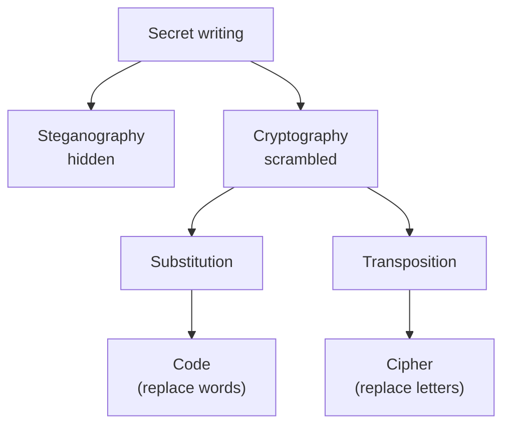
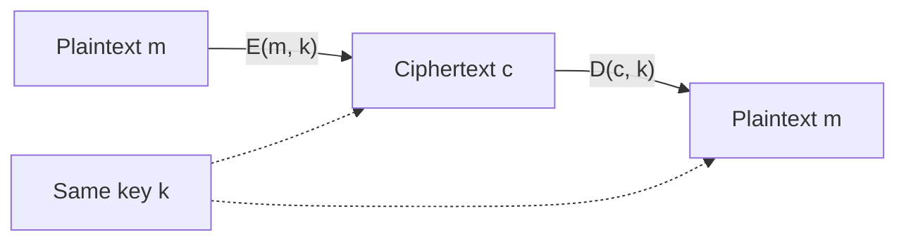
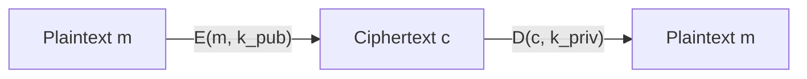
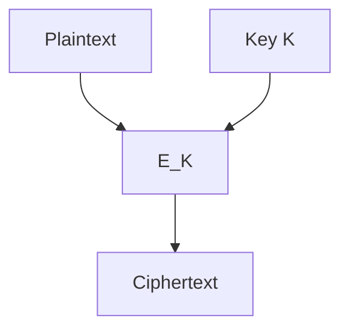
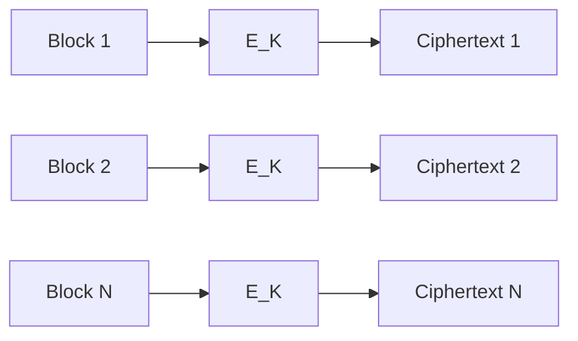
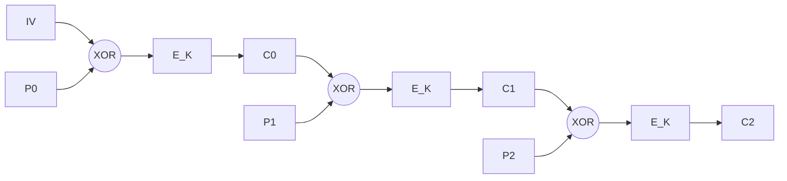
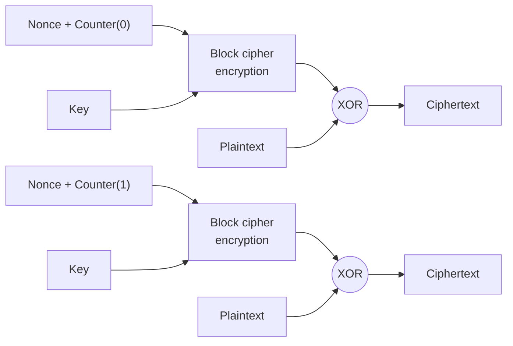
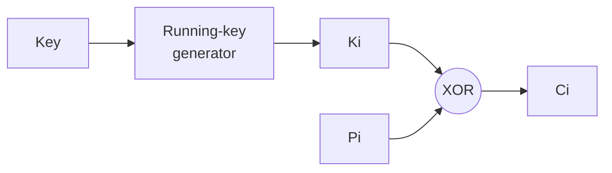
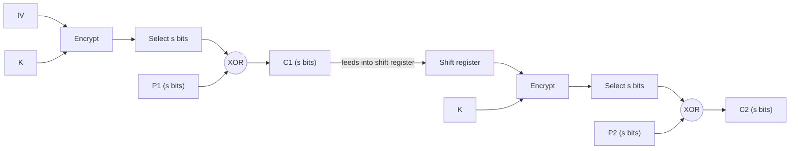
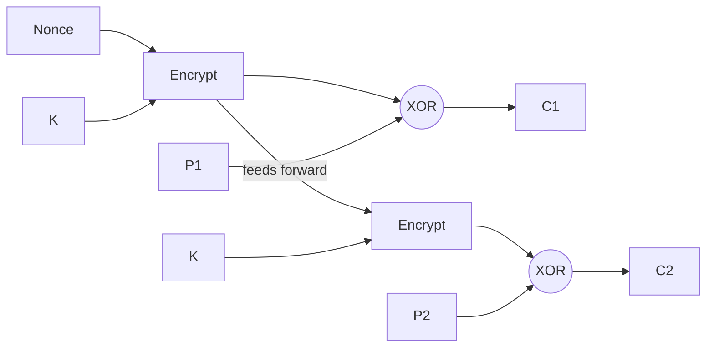

## What Cryptography Can Do

Cryptography is just one tool in the security toolbox, but it's an unusually versatile and powerful one. It helps solve several of the core problems in security:

- **Keeping secrets**, whether that's messages travelling across a network or data sitting on a disk, a memory card, or a USB stick.
- **Ensuring integrity**, both for messages in transit (through message authentication codes) and for data at rest.
- **Authentication**, which splits into user authentication (protecting shared secrets during communication) and message authentication (verifying the sender, verifying the message itself, or both at once).

## Keeping Secrets: Steganography, Codes, and Ciphers

There are three distinct ways to keep a message secret, and it's worth being precise about the difference, since they get conflated in casual speech.

**Steganography** hides the *existence* of the message altogether, using inconspicuous carriers like invisible ink or microdots. If the hidden message is ever found, the secret is fully revealed, there's no second layer of protection. A well documented real-world case is the discovery that some al-Qaeda communications were hidden inside ordinary-looking video files.

**Codes** replace whole symbols or words in a message with substitute codes, where the substitution has been agreed in advance between the parties. A code is inconspicuous as long as the code itself is well designed and doesn't look obviously suspicious.

**Ciphers** hide the *meaning* of a message rather than its existence, scrambling it according to a publicly known algorithm. Unlike steganography and codes, a ciphertext is conspicuous, anyone can see that a secret message exists, they just can't read it.

These three techniques sit under the umbrella of "secret writing," which splits first into steganography (hidden) versus cryptography (scrambled), and cryptography itself splits further into substitution and transposition, which in turn map onto codes (replacing whole words) and ciphers (replacing individual letters):

## Cipher = Algorithm + Key

A modern cipher separates the encryption *algorithm*, which is public and standardized, from the *key*, which is secret. Encryption transforms a plaintext $m$ into a ciphertext $c$ using a key $k$:

$$c = E(m, k)$$

Decryption reverses this using the same or a related key:

$$m = D(c, k) = D(E(m, k), k)$$

This split is the basis of **Kerckhoffs's principle**, first stated by Auguste Kerckhoffs in *La Cryptographie Militaire* (1883): no cipher should rely on the secrecy of the algorithm itself. Only the key needs to stay secret. This is why cryptographic algorithms today are published openly and subjected to years of public scrutiny, security comes from the difficulty of finding the key, not from hiding how the algorithm works.

## Basic Building Blocks

Cryptography is built from a handful of core primitives, each with a distinct purpose:

- **Symmetric ciphers** use one key for both encryption and decryption.
- **Asymmetric ciphers** use two keys, one for encryption and one for decryption, structured so that it's not computationally feasible to derive one key from the other.
- **Cryptographic hash functions** use no key at all. They scramble a variable-length input into a fixed-length output in a way that can't be reversed.
- **Digital signatures** use one key (the private key) to sign data, and a different key (the public key) to verify that signature.

There are also more advanced algorithms, protocols, and constructs built on top of these primitives, but they fall outside the scope of this lecture.

### Symmetric Cryptography

The decryption key is identical to the encryption key (or trivially derivable from it). Both parties need to already share this key before they can communicate.

### Asymmetric Cryptography

The decryption key cannot be derived from the encryption key. A message is encrypted with the recipient's public key, $k_{pub}$, and only the matching private key, $k_{priv}$, can decrypt it:

### Cryptographic Hash Functions

A hash function $H$ takes a variable-length plaintext $m$ and produces a fixed-length hash value $h = H(m)$, often called a "fingerprint" or "digest" of $m$. To count as cryptographic, a hash function must satisfy three properties:

1. **Preimage resistance**: given $M$, computing $h = H(M)$ is easy.
2. **Second preimage resistance**: given $h$, it's intractable to find any $M$ such that $H(M) = h$.
3. **Collision resistance**: it's intractable to find any two distinct messages $M$ and $M'$ such that $H(M') = H(M)$.

### Message Authentication Codes (MAC)

A MAC protects the integrity of a message using a hash function combined with a shared secret. A common construction prepends (and appends) the shared secret key $K$ to the message $M$ before hashing:

$$\text{MAC}(K, M) = H(K \,\|\, M \,\|\, K)$$

HMAC is the most widely used MAC construction of this general shape; it's formally defined in RFC 2104.

### Digital Signatures

Signing an entire message directly with asymmetric cryptography is expensive, so in practice the sender signs the message's hash (its fingerprint) instead of the message itself. The signing operation uses the private key, $S(h, k_{priv})$, and verification uses the public key, $V(h, k_{pub})$, checking that the recovered hash matches a freshly computed hash of the received message.

## Security Properties by Primitive

Each primitive provides a different combination of guarantees:

- **Symmetric cryptography**: confidentiality of messages, where every party holding the shared key (possibly more than two) can decrypt.
- **Asymmetric cryptography**: confidentiality of messages, where only the single party holding the private key can decrypt.
- **Hash functions**: a hash value corresponds to a given message with very high probability, this underlies integrity checking.
- **Message Authentication Codes**: integrity of the message (from the hash function) plus authenticity of the message (from the shared secret).
- **Digital signatures**: integrity and authenticity, same as a MAC, plus **non-repudiation**, assuming the private key itself stays secure.

## Protection Goals

Before reaching for a cryptographic solution, it's worth being explicit about exactly which protection goal you actually need:

- Confidentiality
- Integrity
- Authenticity
- Non-repudiation

People often say things like "our system provides secure communication" without specifying what that actually means in these terms. Since cryptography is computationally expensive, the right approach is to only use the specific building blocks that serve the goals you actually have, rather than reaching for every tool at once.

## Characteristics of Good Ciphers

Claude Shannon, the father of information theory, laid out five properties of a good cipher in 1949:

1. The amount of secrecy needed should determine the amount of labor appropriate for encryption and decryption.
2. The set of keys and the enciphering algorithm should be free from complexity.
3. The implementation of the process should be as simple as possible.
4. Errors in ciphering should not propagate and corrupt further information in the message.
5. The size of the enciphered text should be no larger than the size of the original message.

## Security of Cryptographic Solutions

There are three classes of attack against a crypto-system: attacking the cipher itself (the algorithm and its mode), attacking the key (the key space, key generation, or key management), and attacking the surrounding cryptographic protocol.

Most crypto-systems are only "computationally secure," not perfectly secure. Security is typically measured in the number of operations required by the best known attack, called the **workload**. For a strong algorithm under brute force, the workload is roughly key-length divided by two (on average, an attacker finds the key after searching half the key space). It's also worth flagging that the hardness of many currently used algorithms, particularly asymmetric ones based on factoring or discrete logarithms, would be substantially undermined by a sufficiently powerful quantum computer.

### Cryptanalysis: Attacking the Cipher

Cryptanalysis attempts to recover the plaintext without access to the key, but with full knowledge of the algorithm (consistent with Kerckhoffs's principle above). There are four general types of cryptanalytic attack, ordered roughly from weakest to strongest attacker capability:

- **Ciphertext-only attack**: the attacker only has access to ciphertext.
- **Known-plaintext attack**: the attacker has some matching plaintext/ciphertext pairs.
- **Chosen-plaintext attack**: the attacker can choose plaintexts and obtain their ciphertexts.
- **Adaptive chosen-plaintext attack**: the attacker can choose plaintexts based on the ciphertexts received so far.

Not every effective attack is mathematical. "Rubber-hose cryptanalysis," also jokingly called the purchase-key attack, refers to simply coercing or bribing someone into revealing the key directly, referenced in the well-known xkcd comic about a $5 wrench being more efficient than cryptanalysis. It's a useful reminder that the weakest link in a cryptosystem is very often a human, not the mathematics.

### Cryptanalysis: Attacking the Key

**Key space attacks** search the space of possible keys directly. Exhaustive key search (brute force) is practical against short keys, DES has a fixed 56-bit key and can be cracked very quickly today, which is why AES uses 128, 192, or 256-bit keys instead (the algorithm itself allows even longer keys). Asymmetric algorithms need keys an order of magnitude longer than symmetric ones to reach equivalent security, though elliptic curve cryptography achieves the same security level with meaningfully shorter keys than classical Diffie-Hellman or RSA.

**Key generation attacks** exploit weaknesses in how keys are created. A proper 128-bit key is 16 random bytes, far too long to memorize, which is why key derivation functions (KDFs) exist: they take a human-memorable password and turn it into a cryptographic key. This also means guessing the password is equivalent to knowing the key, so a weak password undermines the strongest algorithm.

**Key management attacks** target the surrounding lifecycle: keys must be stored, shared, and distributed, and every one of these steps is a potential attack surface, independent of how strong the algorithm or the key itself is.

### Review Questions

**Q1.** A company wants to securely transfer a large file between two remote offices. It needs secure establishment of a session key, efficient encryption of the large file, and protection against modification of the encrypted data. Which architecture is most appropriate?

A. Use only hashing
B. Use asymmetric cryptography for key establishment and authenticated symmetric encryption for the data
C. Use only RSA for the entire file
D. Use digital signatures and hashing

*Answer: B.* Asymmetric cryptography is well suited to establishing a session key securely, but far too slow to encrypt a large file directly. Symmetric encryption handles the bulk data efficiently, and it needs to be authenticated (not just encrypted) to protect against modification. This combination is exactly the hybrid cryptosystem pattern covered later in this note and expanded on in Cryptography II.

**Q2.** A company has 20 branches. Each branch needs to communicate securely with every other branch using symmetric encryption. Statement I: pairwise symmetric keys can create a key-management scalability challenge as the number of communicating parties increases. Statement II: symmetric cryptography completely eliminates the need for key management.

A. Statement I is True, Statement II is True
B. Statement I is True, Statement II is False
C. Statement I is False, Statement II is True
D. Statement I is False, Statement II is False

*Answer: B.* With $n$ parties needing a unique shared key for every pair, the number of keys required grows as $n(n-1)/2$, for 20 branches that's 190 separate keys, a real scalability problem. Symmetric cryptography doesn't eliminate key management, it actually makes it harder, since every one of those keys still has to be generated, distributed, and protected.

## One Time Pads

A one time pad consists of a large, non-repeating sequence of truly random characters, used exactly once. Encryption XORs each letter of the plaintext with the corresponding letter of the pad:

$$C = P \oplus K$$

Decryption XORs each letter of the ciphertext with the same pad:

$$P = C \oplus K$$

One time pads produce **perfectly secure** encryption, known as information-theoretic security: the cryptosystem cannot be broken by an attacker with literally unlimited computational resources, since the ciphertext gives no statistical information about the plaintext whatsoever. This result, too, traces back to Claude Shannon's work. In practice, one time pads are rarely usable, since the key must be as long as the message, truly random, and never reused, which is an extremely demanding logistical requirement.

## Symmetric Cryptography: Block and Stream Ciphers

Symmetric cryptography splits into two main classes.

**Block ciphers** include DES (badly broken today, though still found in older textbooks, since its keys are too short to resist brute force), Triple DES (3DES, still seen in the wild, but scheduled for retirement, computed as $C = E_{K3}(D_{K2}(E_{K1}(P)))$), and AES, the current NIST-adopted standard.

**Stream ciphers** include A5/1 (used in GSM networks, essentially broken today) and RC4 (notoriously difficult to use securely). Block ciphers can also be used to construct stream ciphers, and this is often the better engineering choice in practice, covered below.

### Block Cipher Algorithms

A block cipher operates on fixed-size blocks of plaintext and ciphertext, typically 32, 64, or 128 bits:

The algorithm itself only describes how to transform one block of a fixed size. Two questions immediately follow: what happens when the plaintext is shorter than the block size, and what happens when it's longer? These questions are exactly what encryption schemes, or modes, exist to answer.

### Algorithms vs. Schemes/Modes

A cryptographic *algorithm* describes the transformation between plaintext and ciphertext at the level of a single fixed-size block; it says nothing about how that transformation gets used in an actual system. When a message doesn't fit the algorithm's block size exactly, it gets padded. A *scheme* or *mode* is the layer on top that defines how to encrypt plaintexts of arbitrary length, and how to use initialization vectors to make every encryption unique, even when the same plaintext is encrypted twice with the same key.

To encrypt a long plaintext, it's simply divided into blocks of the algorithm's fixed size (padding the final block if needed), and each block is run through the algorithm:

How exactly the blocks relate to each other during this process is what separates the different modes below.

### Electronic Codebook Mode (ECB)

ECB is the simplest possible application of a block cipher: each plaintext block is encrypted completely independently into its own ciphertext block, using the diagram above with no modification. Critically, the same plaintext block always produces the same ciphertext block under the same key, which is really just a substitution cipher operating over an enormous "alphabet" (for AES, an alphabet of $2^{128}$ possible symbols).

This independence gives ECB two genuinely useful properties: blocks can be encrypted and decrypted in any order, and in parallel. The "random order" property is what lets ECB-encrypted file systems support a "seek" operation, since blocks are independently addressable (this does require block alignment, but disk blocks are typically multiples of 32, 64, or 128 bits anyway, e.g. 512B, 1024B, or 4096B).

The problem is that this same independence leaks structure. The canonical illustration is the "ECB penguin": encrypting an image of the Linux mascot, Tux, block by block under ECB produces a ciphertext image where the outline of the penguin is still clearly visible, since identical regions of flat color produce identical ciphertext blocks. Encrypting the same image under a proper mode (like CBC) instead produces what looks like pure random noise, with no visible structure at all. Beyond images, real messages often have stereotyped beginnings ("Dear Foo") and endings ("Best regards, Bar"), so a cryptanalyst who learns the encryption of one plaintext block can immediately decrypt that same block wherever it appears in any other message encrypted with the same key. ECB is also vulnerable to block replay attacks, since an attacker can cut and paste valid ciphertext blocks from one message into another.

### Cipher Block Chaining Mode (CBC)

CBC fixes ECB's weakness by introducing a feedback mechanism: the previous ciphertext block is mixed into the encryption of the current plaintext block, so identical plaintext blocks no longer produce identical ciphertext.

$$C_i = E_k(P_i \oplus C_{i-1})$$
$$P_i = C_{i-1} \oplus D_k(C_i)$$

An initialization vector (IV) takes the place of $C_{-1}$ to start the chain off. The IV doesn't need to be kept secret (it can be a nonce, a sequence number, a date, anything unique), but it absolutely must never be reused with the same key.

Decryption runs the same structure in reverse, decrypting each ciphertext block and then XORing the result with the *previous* ciphertext block (or the IV, for the first block) to recover the plaintext.

### Counter Mode (CTR)

CTR mode turns a block cipher into something that behaves like a stream cipher. Instead of encrypting the plaintext directly, it encrypts a combination of a nonce and an incrementing counter, and XORs the result with the plaintext:

Because only the counter changes between blocks (never the plaintext or ciphertext of a previous block), every block can be encrypted or decrypted completely independently and in parallel, unlike CBC. Decryption is symmetric: the same nonce-and-counter values are encrypted again (never decrypted, the "encrypt" box is used on both sides), and the result is XORed with the ciphertext to recover the plaintext.

## Stream Ciphers

A stream cipher works one bit or byte at a time rather than in fixed blocks. A running-key generator produces a pseudo-random stream of bits used for encryption, seeded by the actual key:

If the same running key were reused every time, cryptanalysis would become trivial. A completely random running key would be equivalent to a one time pad, giving perfect security, but this isn't achievable in practice for the same reasons one time pads generally aren't. Since stream ciphers don't need an entire block to work, they're a good fit for character-based applications where data arrives one unit at a time.

### Building Stream Ciphers from Block Ciphers

Block ciphers can be repurposed to build a stream cipher. As an example, take a 64-bit block cipher used to build a byte stream cipher: a 64-bit "shift register" is encrypted, and its leftmost byte is XORed with the plaintext byte to produce ciphertext. The shift register is then shifted one byte to the left, and the newly produced ciphertext byte is inserted at the right-hand end. As with any mode using an IV, the initial value of the shift register must be unique, for example a serial number.

### Cipher Feedback Mode (CFB)

CFB is one concrete way of building a stream cipher out of a block cipher, using a shift register as described above. On encryption, the shift register (seeded by the IV) is encrypted, $s$ bits are selected from the result and XORed with $s$ bits of plaintext to produce ciphertext, and that ciphertext is fed back into the shift register for the next step:

Decryption mirrors this exactly, except the received ciphertext is what's fed back into the shift register, and it's XORed against the encrypted shift-register output to recover the plaintext.

### Output Feedback Mode (OFB)

OFB looks similar to CFB, but with one important structural difference: it's the *output of the encryption step itself* that's fed forward into the next encryption step, not the ciphertext. This means the entire keystream can be generated in advance, independent of the plaintext or ciphertext entirely:

Because the keystream doesn't depend on the ciphertext at all, a single bit error in transmission only corrupts the corresponding bit of recovered plaintext in OFB, unlike CFB or CBC, where an error can propagate into neighboring blocks. The tradeoff is that, unlike CTR mode, OFB blocks cannot be processed in parallel, since each step depends on the output of the previous one.

## Asymmetric Cryptography, Revisited

Asymmetric cryptography's decryption key cannot be derived from its encryption key, using a public key $k_{pub}$ for encryption and a private key $k_{priv}$ for decryption. Compared to symmetric cryptography, it's significantly less efficient, both slower and requiring much longer keys for equivalent security. In practice, it's essentially never used to encrypt large amounts of data directly; instead it's used as a building block for key exchange and other protocols, a pattern expanded on considerably in Cryptography II.

### Review Question

**Q.** A company uses AES-CBC to encrypt network messages. An attacker cannot decrypt the messages but modifies some ciphertext before it reaches the receiver. The receiver decrypts the modified ciphertext without detecting the manipulation. What is the main issue?

A. Encryption alone does not necessarily provide integrity/authentication
B. AES cannot provide confidentiality
C. Symmetric encryption cannot use keys
D. CBC automatically detects all modifications

*Answer: A.* Encryption protects confidentiality, it says nothing at all about whether the ciphertext was tampered with in transit. CBC has no built-in integrity check, so a modified ciphertext block still decrypts to *something*, just not the original plaintext, and nothing flags this as tampering. Integrity requires a separate mechanism layered on top, like a MAC or a digital signature, exactly as covered earlier in this note.

## Sample Asymmetric Encryption Algorithms

Asymmetric encryption is built on computationally hard problems, problems believed to have no efficient solution on classical computers. The major families include RSA (based on the difficulty of factoring large numbers into their prime components), Diffie-Hellman (based on the difficulty of modular arithmetic, specifically discrete logarithms), and elliptic-curve variants of Diffie-Hellman.

An asymmetric *encryption scheme*, as opposed to the raw algorithm, defines how the algorithm is actually used in practice: how arbitrary-length messages are handled, how padding is applied, and so on. One property matters enormously here: **semantic security**. The encryption scheme must randomize the message before encrypting it. Without randomization, an attacker who suspects a particular plaintext can simply encrypt their guess under the known public key and compare the result to the observed ciphertext, confirming their guess without ever breaking the underlying algorithm.

### RSA

RSA, published by Rivest, Shamir, and Adleman in 1977, remains the most popular public-key cryptosystem. It supports both encryption and digital signatures, has survived decades of cryptanalytic attack (making it probably secure), and is baked into many official standards worldwide, which matters enormously for interoperability with existing systems.

**Key generation** works as follows: pick two large random primes $p$ and $q$, and compute $n = pq$. Choose a random encryption exponent $e$ such that $e$ and $(p-1)(q-1)$ are relatively prime (share no common factors). Then compute the decryption exponent $d$ using the extended Euclidean algorithm, such that

$$ed \equiv 1 \pmod{(p-1)(q-1)}$$

The public key is the pair $(e, n)$, and the private key is $d$.

**A toy worked example** (far too small to be secure, but useful for seeing the mechanics): let $p = 5$, $q = 11$, so $n = 55$. Choose $e = 3$ (checking that 3 and $(p-1)(q-1) = 40$ are relatively prime). Solving $3d \equiv 1 \pmod{40}$ gives $d = 27$. So the public key is $(3, 55)$ and the private key is $27$.

**Encryption and decryption**: to encrypt a plaintext block $m_i$ (numerically smaller than $n$):

$$c_i = m_i^{e} \pmod{n}$$

For example, with $m = 7$: $c = 7^3 \bmod 55 = 13$.

To decrypt:

$$m_i = c_i^{d} \bmod n$$

This works because $c_i^d = (m_i^e)^d = m_i^{ed} = m_i^1 \pmod n$ by construction. Continuing the example: $m = 13^{27} \bmod 55 = 7$, recovering the original plaintext.

### ElGamal

ElGamal is based on the difficulty of computing discrete logarithms in a finite field. Key generation picks a prime $p$, and random numbers $g$ and $x$, both less than $p$, then computes

$$y = g^{x} \bmod p$$

The public key is $(y, g, p)$, and the private key is $x$.

**Encryption** of a message $M$: select a random $k$ relatively prime to $p - 1$, and compute

$$c_1 = g^{k} \bmod p, \qquad c_2 = y^{k}M \bmod p$$

The pair $(c_1, c_2)$ is the ciphertext.

**Decryption**: first compute $s = c_1^{x} \bmod p$, then compute the modular inverse $s^{-1} \bmod p$, and recover the message as

$$M = c_2 \cdot s^{-1} \bmod p$$

## Hash Functions, Revisited

Hash functions are the "workhorses" of cryptography, used constantly across almost every other primitive covered in this note. Their main uses are condensing long strings into short, fixed-length strings (needing collision resistance) and making an irreversible transformation without any key at all (a one-way function).

Prominent examples, with their current security status: MD4, MD5, and SHA-0 are all badly broken and should never be used. SHA-1 is broken and still turns up in older standards, but must be fully retired before 2030. SHA-2 is the current standard in widespread use, and SHA-3, standardized since 2015, is the newest standard.

## Security Level

If the best known attack against a cryptographic algorithm is equivalent to running the algorithm $2^n$ times, the algorithm is said to have a security level of $n$ bits. As a rough guide, 80-bit security is now considered too low, 128-bit is decent, and 256-bit is high.

It's tempting to assume security level always equals key length, but this isn't generally true, and there are two important exceptions. For hash functions, the security level against collision attacks is roughly half the hash output size (due to the birthday bound), so the hash size needs to be at least twice the desired security level. For asymmetric cryptography, key length and security level diverge substantially, for example RSA needs key sizes around 1024/2048/4096 bits to reach security levels far smaller than those numbers, since the best attacks against factoring are much faster than brute-force key search.

## Summary on Building Blocks

A few points worth carrying forward from this lecture: always clarify your actual security goals before reaching for a cryptographic tool. Never design your own cryptographic primitives or protocols, always rely on well known, publicly analyzed standards instead, in the spirit of Kerckhoffs's principle. And whatever primitive or protocol you do use, make sure you genuinely understand its security goals, its security level, how to apply it correctly, and its known problems and pitfalls, since a strong algorithm used incorrectly provides no real security at all.