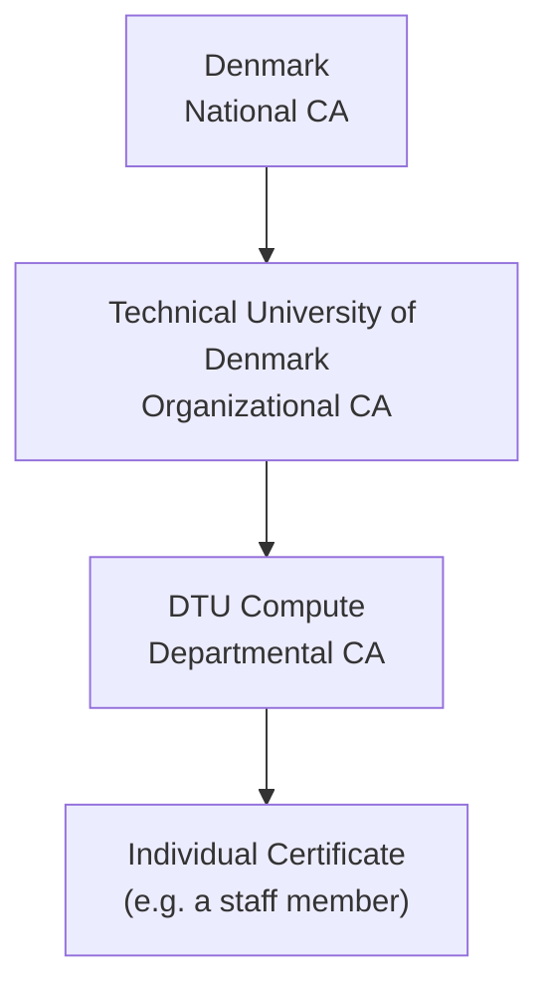
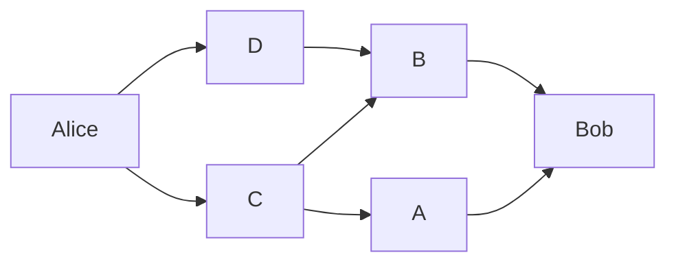
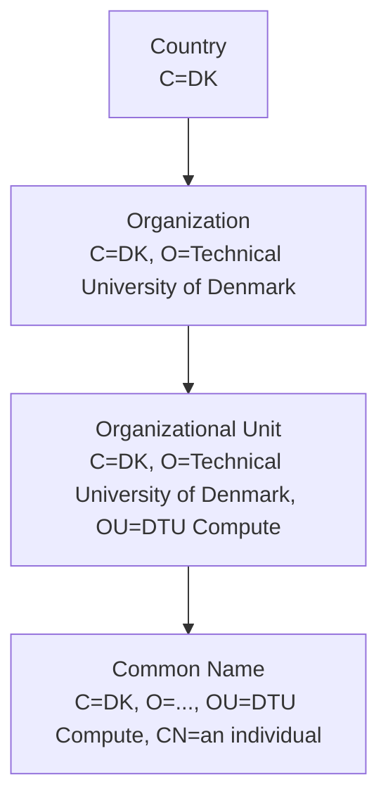

## Cryptographic Protocols

A **protocol** is a defined sequence of steps involving several parties. For something to count as a proper protocol, it needs a few specific characteristics: everyone involved knows the protocol in advance, everyone agrees to follow it, the protocol is unambiguous at every step, and the protocol is complete, covering every situation that can actually arise.

Descriptions of cryptographic protocols conventionally use a cast of named characters. Alice and Bob are the parties who want to communicate securely (Charlie and Dave get added for protocols involving more than two honest parties). Eve is a malicious eavesdropper who wants to listen in without necessarily interfering. Mallory is a malicious attacker of any kind, including one who actively interferes. Trent is a trusted arbitrator, a Trusted Third Party (TTP) that all the honest parties agree to rely on.

Cryptographic protocols describe how multiple parties actually employ cryptography together: how each party uses the underlying algorithms, and how cryptographic keys are managed, covering key distribution explicitly and sometimes key generation as well. There are three broad types of protocol, distinguished by how much they rely on a trusted third party.

### Arbitrated Protocols

An arbitrator is a disinterested trusted third party, think of lawyers, notaries, or banks in everyday life. All parties in the protocol must trust the same arbitrator. Because the arbitrator plays an active role in every single transaction, it introduces a delay, becomes a bottleneck as usage scales, and represents a single point of failure for the whole system.

### Adjudicated Protocols

Adjudicated protocols reduce the cost of arbitration by splitting the protocol into two parts: an ordinary, non-arbitrated protocol used for everyday transactions, and a separate arbitrated protocol invoked only to resolve disputes. The non-arbitrated part needs to produce non-disputable evidence of what actually happened, which is exactly why non-repudiation (introduced in Cryptography I) matters so much. The adjudicator, much like a judge in the legal system, only gets involved when there's a disagreement, and all parties need to agree in advance to follow whatever judgement the adjudicator reaches.

### Self-Enforcing Protocols

A self-enforcing protocol guarantees fairness through its own structure, with no need for any third party at all. It's designed so that disputes simply cannot arise, and any attempt to cheat is detected before real damage is done, at which point the protocol simply stops. These are the most desirable kind of protocol whenever they're achievable, since they avoid the cost, delay, and single point of failure that come with arbitration. A cake-cutting protocol where one person cuts and the other chooses first is a classic everyday example of self-enforcing fairness, and a similar "cut and choose" idea reappears later in this note in the context of blind signatures.

## Encrypted Communication in Practice

A real secure communication session has three phases. The **handshake** takes the initial steps: agreeing on the cryptographic protocol itself, including which algorithms and modes to use and what session key to establish, and authenticating the communicating parties, either single-sided (typically just the server, as in most web browsing) or mutual (both parties authenticate each other). The **communication** phase is the steady-state operation: messages are sent and received securely, with confidentiality protected through encryption and integrity protected through a MAC or digital signatures. **Connection termination** deletes all session-specific state, keys, cookies, and anything else tied to that particular session, so nothing lingers that could later be compromised.

## Usage of Cryptographic Keys

Keys can be categorized by what they're actually used for. A **data key** is used directly for a cryptographic purpose, like encrypting or authenticating a specific piece of data. A **key-encryption key** is used to encrypt other keys, for example during key exchange or key storage. A **master key** is used to derive other keys, typically through a key derivation function, for example:

$$\text{Session\_Key} := \text{KDF}(\text{Master\_Key}, \text{Session\_Number})$$

## Cryptographic Key Management

Key management covers the full lifecycle of a key: generation, distribution, storage, and eventually expiration or revocation.

**Distribution** splits into two sub-cases. In **key exchange**, one party generates the key and it must then be transported securely to everyone else. In **key agreement**, all parties jointly influence the generation of the key, the Diffie-Hellman algorithm being the classic example for two parties.

**Perfect Forward Secrecy (PFS)** is a property worth calling out specifically: it ensures that a session key derived from a set of long-term keys stays safe even if one of those long-term keys is compromised at some point in the future. Without PFS, compromising a single long-term key retroactively exposes every past session that depended on it.

### Key Generation

A cryptographic key must be intractable to guess, meaning every possible key value should be equally likely, with no bias an attacker could exploit. Common generation methods include password-based key derivation functions, which turn a human-readable string into a usable key, and random number generators, of which there are three meaningfully different kinds. A purely statistical RNG is not cryptographically secure and should never be used for cryptographic purposes. A pseudo-random number generator (PRNG) can be used, but must be seeded correctly, careless seeding is a very common real-world vulnerability. A true random number generator draws on measurements of genuinely unpredictable physical processes, giving "real" randomness, but this is too expensive for most applications (true random numbers are available as a service online, for example via random.org, for cases where it's worth the cost).

### Key Exchange: Requirements and Techniques

Beyond simply generating a key, it also has to reach every legitimate party securely. This raises a specific checklist of requirements: preventing others from seeing the key (solved through encryption), authenticating the legitimate sender and receiver (solved through identity verification and digital signatures), actually distributing the key to legitimate parties (a secure key exchange protocol), ensuring the key is fresh rather than stale or replayed (solved through policy, key freshness checks, nonces, and timestamps), and letting legitimate parties confirm they actually received the key correctly (mutual authentication and acknowledgements). When this has to happen remotely, cryptography does the work; sometimes, when it's an option, a personal, in-person key exchange is simply easier and more trustworthy.

In terms of concrete techniques, a key can be generated jointly by all parties working together (key agreement), generated by one party and published somewhere public (a Public Key Infrastructure), generated by one party and sent directly to the other (key transport), or generated by a trusted third party and sent to everyone (TTP key transport, where the TTP is often specifically called a Key Distribution Center, or KDC, as used in Kerberos).

### Key Storage

Keys need protecting both while in use and at rest. **In use**, keys must sit in memory while actively needed, session (data) keys throughout the life of a session, and other keys only for as long as they're actually needed, typically just during the handshake, after which they should be overwritten in memory immediately. Keys lingering in memory longer than necessary was exactly the class of problem exposed by the Heartbleed vulnerability. **At rest**, keys and key material must be encrypted wherever they're stored, a password manager is a familiar everyday example of this principle in action. For particularly sensitive keys, Hardware Security Modules (HSMs) provide dedicated hardware specifically for key management and cryptographic operations, keeping key material out of general-purpose memory entirely.

### Key Expiration and Compromise

Keys can, and should, eventually expire. This raises practical questions: how expiration gets tracked (often through a centralized key management service, like AWS KMS), how all affected users get informed in time (automated notifications, rolling announcements), how a replacement key gets set up securely, and what happens to old key material afterward, whether it's archived or deleted, and if deleted, how deletion gets verified across every copy in a distributed system, which is genuinely difficult.

Key compromise is the worst case, arising either because an attacker gained access to the key itself, or because the underlying algorithm was broken. The response has three parts: the key must never be used again (expiration), every concerned party has to be informed (key revocation), and old data protected under that key needs attention, whether through re-encryption, re-signing, or outright destruction of all copies.

### Review Scenario

A company operates a private 5G network connecting industrial sensors, autonomous vehicles, and edge servers. All sensitive communication uses symmetric encryption, and keys are stored on individual devices. Over time, some devices are found compromised, and several employees who previously had key access have since left the company. The security manager proposes: generating unique keys per device, storing all keys in a centralized, access-controlled key management system, rotating keys periodically and immediately revoking keys tied to compromised devices, and giving all network administrators access to every key to simplify management.

**Which approach provides the most secure key-management strategy?**

A. Store all keys locally on devices and allow administrators to share keys when needed.
B. Use unique keys per device, centrally manage them through an access-controlled KMS, rotate and revoke keys when necessary, and enforce least-privilege access.
C. Use one master encryption key for all devices and change it only when a device is compromised.
D. Give all administrators unrestricted access to all keys but change the keys every six months.

*Answer: B.* Effective cryptographic key management requires secure key storage, controlled access, key rotation, revocation, and full lifecycle management, all together. The proposal's first three points are sound practice, but the fourth (universal admin access) directly violates least-privilege access and should be rejected; giving every administrator access to every key turns a single compromised admin account into a compromise of the entire network.

## Symmetric-Key Cryptography Protocol

Setting up communication with symmetric-key cryptography (SKC) requires five steps, each of which opens a distinct attack surface:

1. Alice and Bob agree on a cryptosystem, vulnerable to a man-in-the-middle downgrading the negotiation, weak key choices, or key reuse.
2. Alice and Bob agree on a key, vulnerable to key interception.
3. Alice encrypts her plaintext with the key, vulnerable to weak IVs, weak padding, or plain implementation bugs.
4. Alice sends the ciphertext to Bob, vulnerable to replay attacks or denial of service.
5. Bob decrypts the ciphertext with the key, vulnerable to information leaking through differences in how errors are handled.

### Problems with SKC

Keys must be distributed in advance and kept secret from everyone outside the protocol. A compromised key reveals everything ever encrypted with it. Keys can be compromised in several ways: weak keys (from a weak PRNG or KDF) can simply be guessed; a man-in-the-middle attack can intercept the key exchange itself; and compromising a host that holds a key compromises the key too, if the probability a given host is compromised is $p$, the probability that their *shared* key is compromised is roughly $2p$, since either host being compromised is enough.

Because both parties hold the identical key in SKC, a compromised key lets an attacker masquerade as *either* party, which is exactly why SKC cannot be used directly in adjudicated protocols, there's no way to prove afterward which of the two parties actually sent a given message. Finally, SKC doesn't scale: every pair of communicating parties needs its own distinct key, so $n$ users require $n(n-1)/2$ keys in total, the same quadratic scaling problem introduced with the Diffie-Hellman motivation earlier in this course.

## Key-Exchange Protocols

Assume a Key Distribution Center (KDC) exists, and every participant already shares a key with the KDC individually.

**Shared-key (symmetric) protocol**: Alice sends a request to the KDC asking for a session key to talk with Bob. The KDC generates the session key $K_{AB}$ and returns it twice over, encrypted once under Alice's key and once under Bob's: $K_A(K_{AB})$ and $K_B(K_{AB})$. Alice decrypts her copy and forwards Bob's encrypted copy to him. Bob decrypts his copy, and now both parties know $K_{AB}$ without it ever having travelled in the clear.

**Public-key (asymmetric) protocol**: Alice retrieves Bob's public key from the KDC. Alice generates a random session key $K$ and sends it to Bob encrypted under his public key, $K_{pub\_B}(K)$. Bob decrypts it with his private key, $K_{priv\_B}(K)$, and now both parties know $K$.

## Public-Key Cryptography Protocol

Setting up communication with public-key cryptography (PKC) also has five steps, each with its own attack surface:

1. Alice and Bob agree on a cryptosystem, vulnerable to weak key choices or misconfiguration.
2. Bob sends Alice his public key, vulnerable to a compromised Certificate Authority or a rogue certificate substituting a fake key.
3. Alice encrypts her plaintext with Bob's public key, vulnerable to weak IVs or chosen-ciphertext attacks.
4. Alice sends the ciphertext to Bob, vulnerable to replay attacks or denial of service.
5. Bob decrypts the ciphertext using his private key, vulnerable to compromise of that private key.

### Public-Key Distribution

Distributing public keys securely requires addressing three separate concerns: **authenticity** (linking a public key to a specific named identity, i.e. certification), **distribution** (obtaining someone else's public key, and distributing your own), and **revocation** (revoking a key that's been published, and letting others determine whether a given public key is still valid). The rest of this note works through how a Public Key Infrastructure addresses all three.

## Hybrid Cryptosystems

Asymmetric cryptography is roughly three orders of magnitude slower than symmetric cryptography, and it's also vulnerable to a specific class of attack worth understanding directly: if $C = E(P)$ where $P$ is a plaintext with limited entropy $n$ (for example, a small fixed set of possible messages), an attacker can simply encrypt every possible plaintext under the known public key and compare each result against the observed ciphertext $C$. This lets the attacker learn the plaintext without ever breaking the private key or the underlying algorithm, a reminder that a cryptosystem can fail to achieve its actual security goals even when neither the algorithm nor the key itself is broken; using strong primitives correctly matters just as much as choosing them.

This combination of weaknesses is exactly why asymmetric cryptography is used to encrypt a randomly generated *symmetric* session key, rather than the real data. This has several advantages: a randomly chosen symmetric key has entropy close to its full key size, avoiding the low-entropy attack above; the symmetric key itself is short, so encrypting it costs far less than encrypting the actual message would; and the encrypted key reveals very little useful information about the underlying asymmetric key.

**The hybrid protocol** runs as follows: Bob sends Alice his public key. Alice generates a random session key $K$. Alice encrypts $K$ with Bob's public key and sends it to him. Bob decrypts $K$ with his private key. Alice and Bob then exchange the actual messages, encrypted under the fast symmetric session key $K$. These steps still require the authenticity of Bob's public key and the authentication of both endpoints, which is precisely the problem a PKI exists to solve.

## Public Key Distribution, in Practice

Public-key cryptography meaningfully simplifies key distribution, since the encryption key itself doesn't need to stay secret at all, only the private key does. What's still required is authenticating that a given public key genuinely belongs to the party you think it does. This can happen **in-band** (online), typically through a Public Key Infrastructure backed by Key Distribution Centers or Certificate Authorities, or **out-of-band**, for example built directly into a product at manufacture time, or (historically) published in a newspaper on a fixed schedule.

### Certification Authorities

A **certification authority (CA)** guarantees that a given key genuinely belongs to a named principal. A principal doesn't have to be an individual person, it can be a user, an attribute of a user (like their role within an organization), an organization itself (a company, or even another CA), a pseudonym, or a piece of hardware or software. Some CAs restrict themselves to certifying only certain types of principal.

**A concrete real-world example**: inspecting the TLS certificate for a course website (learn.inside.dtu.dk) in a browser shows exactly what a CA-issued certificate contains in practice. The "Issued To" section names the common name (the site's domain), while "Issued By" names the CA, in this case Amazon RSA 2048 M02. A validity period gives an issue and expiry date (here, spanning about thirteen months), and SHA-256 fingerprints are given for both the certificate itself and the public key it contains, letting anyone independently verify the certificate hasn't been tampered with.

### Obtaining a Certificate from a CA

Suppose Alice wants a certificate from Charlie, acting as the CA. The process runs in five steps. First, Alice generates a public/private key pair, then signs the public key together with her identification information using her own private key, which proves she genuinely knows the private key and protects both the key and her ID in transit to the CA. Second, Charlie verifies Alice's signature and her identity, sometimes through out-of-band checks like an email or phone callback, or by consulting business or credit bureau records. Third, Charlie signs Alice's public key and ID with the CA's own private key, creating a certificate that formally binds Alice's public key to her identity. Fourth, Alice verifies the public key, her ID, and the CA's signature on the returned certificate, confirming Charlie didn't substitute a different public key along the way. Finally, Alice and/or Charlie publish the finished certificate.

### PKI Hierarchies

Certificate authorities are typically organized into a hierarchy, so that only the top-level CA's certificate (the "root CA") needs to be known and trusted by literally everyone. Intermediate CAs hold certificates signed by their superiors in the hierarchy, and verifying any given certificate means walking the chain of signatures from that certificate all the way up to a trusted root.

This hierarchical model isn't the only option. A **web of trust**, the model used by PGP and GPG, replaces the strict top-down hierarchy with a mesh of individual trust relationships closer to how humans actually build trust with each other: Bob trusts B and D directly, who in turn trust A and C, who trust Alice, so Bob ends up able to trust that a key really came from Alice through a chain of personal vouching, even without ever meeting her or relying on any single central authority.

### What's in a Name

Names are far more context-dependent than they first appear. "Bob" might be personally known to everyone in a small village, where people also carry multiple names (Robert Johnson, "Big Bob the sheriff," and so on). But in a larger town there might be several different people all called Bob or Robert, and nobody necessarily knows that "Robert Johnson" and "Big Bob" refer to the same person. Scale this up to an entire city or country, and the bare string "Bob" loses almost all meaning as an identifier. This is why real naming systems add qualifiers, a passport number, a national civil registration number, anything that disambiguates "which Bob" a certificate is actually vouching for.

### X.500 Naming

X.500 defines **Distinguished Names (DN)**, intended to uniquely name absolutely anything on earth by building up a hierarchical path of increasingly specific components:

The typical DN components are Country (C), State or Province (SP), Locality (L), Organization (O), Organizational Unit (OU), and Common Name (CN). The scheme has real limitations, though: there's no fixed rule for how the naming hierarchy should actually be organized in a given context, and a strictly hierarchical structure like this only really fits clearly hierarchical settings, like governments or national telecom providers. It struggles to accommodate people who don't fit neatly into one hierarchy at all, nomadic people, stateless people, or people holding dual citizenship, for instance.

### What's in a Certificate

A typical certificate contains the public key itself (for example, a 4096-bit RSA key), identification information (often an X.500 DN), a validity period (not valid before / not valid after; TLS certificates today are valid for at most 13 months), issuer identification (used to establish the certification path back to the root CA), and the issuer's signature over all of the above. Extensions can further qualify the certificate, restricting it to certain purposes only, which matters especially for CA certificates, since this is what establishes the actual domain of authority a given CA is allowed to operate within.

### Authority of a CA

It's worth asking directly: what is the actual root of authority for a CA? A TLS certificate binds a public key to a business's web server, but the CA issuing that certificate has no authority to register businesses, and no authority to register domain names either, it's only vouching for the specific binding between key and domain. The root certificates that make this whole system function are simply built into browsers and operating systems in advance; Firefox, for example, ships with around 100 root certificates pre-installed, from organizations like DigiCert, Entrust, Google Trust Services, Microsoft, and VeriSign.

### Trust in PKI

Because a root CA sits at the top of the hierarchy, it can compromise the security of literally everyone below it, which means a root CA has to be effectively infallible, yet no single authority in the real world is trusted by absolutely everyone. Worse, trust in a root CA gets diluted as it passes down the certification path, a problem formally exposed by Ueli Maurer's trust model: as a rough illustration, 90% trust in a root CA might translate to only around 60% effective trust in a certificate reached through five levels of intermediate CAs. Adding attributes on top of basic identity magnifies this problem further: a credential granting permission to access some specific resource borrows authority from a root CA that has no direct knowledge of either the principal or the resource involved, and the further down the credential chain you go, the more specific the permissions become while the root CA's actual authority over them grows ever more diluted.

### Certificate Revocation

Certificates must be revoked whenever, not if, a private key is compromised. Revocation systems are judged on three dimensions: the speed of revocation (the maximum delay between discovering a compromise and the certificate's last actual use), the reliability of revocation (whether it's acceptable that some relying parties might occasionally not learn about a revocation in time), and the number of revocations a system can handle at once. Revocation can be automatic, relying on short certificate expiration times so compromised certificates age out quickly on their own, or manual, using Certificate Revocation Lists (CRLs) that relying parties check explicitly.

## Advanced Applications of Cryptography

Asymmetric cryptography enables several interesting applications beyond basic encryption and signatures, including blind signatures, zero-knowledge proofs, and electronic voting systems, covered in turn below.

### Digital Signatures with RSA

Some public-key systems, RSA included, allow either key of the pair to be used for encryption, with the other used for decryption. This makes a basic signature scheme straightforward: Alice encrypts a message with her *private* key, which effectively signs it:

$$\text{sign}(m) = m^{d} \pmod{n} = m'$$

Alice sends $m'$ to Bob, who decrypts it with Alice's *public* key, which verifies the signature:

$$\text{verify}(m') = (m')^{e} = (m^{d})^{e} = m^{ed} = m \pmod{n}$$

Since asymmetric operations are slow, in practice a signer signs a hash of the message rather than the message itself, exactly as covered in Cryptography I.

**A worked example**: let $p = 11$, $q = 13$, so $n = pq = 143$ and $\varphi(n) = (p-1)(q-1) = 10 \cdot 12 = 120$. Choose $e = 7$. Solving $7d \equiv 1 \pmod{120}$ gives $d = 103$. The public key is $(e, n) = (7, 143)$ and the private key is $(d, n) = (103, 143)$.

Suppose $m = 9$ (representing, say, the hash of a longer message). The signature is $m^{d} \bmod n = 9^{103} \bmod 143 = 48$, so Alice sends Bob $m_s = 48$. Bob verifies by computing $48^{7} \bmod 143 = 9$, recovering $m$ exactly and confirming the signature.

### Completely Blind Signatures

Sometimes a notary doesn't need to know what they're signing. Suppose Alice has a document $M$ (in numerical form, modulo $n$) that she wants Bob, holding RSA keypair $(e, n)$ and $(d, n)$, to sign without ever learning $M$'s content.

Alice picks a random blinding factor $X$ with $\gcd(X, n) = 1$, and computes

$$M' = M \cdot X^{e} \pmod{n}$$

This hides $M$ effectively, since $X^e$ looks random to Bob and only Alice knows the actual value of $X$. Alice sends $M'$ to Bob, who signs the blinded document as normal, computing $M'' = (M')^{d} \bmod n$. Alice then divides out the blinding factor from $M''$, leaving her with $M^{d} \bmod n$, a valid signature on her *original*, unblinded document $M$, which Bob never actually saw. This construction relies on the fact that RSA signing and multiplication are compatible with each other (technically, that the signature operation is multiplicatively homomorphic).

### The Limits of Blind Signatures, and Cut-and-Choose

Completely blind signatures are of limited practical use for an obvious reason: if Bob will sign literally anything without seeing it, he might end up signing something malicious, for example an IOU reading "I owe Alice $1,000,000." A completely blind signature gives the signer no control at all over what they're actually vouching for.

The fix is **partial verification** through a cut-and-choose protocol. Alice prepares $n$ documents $M_1, \ldots, M_n$ that are all "synonymous," meaning they all say the exact same thing (for example, "Alice has 1 e-coin"). She blinds each one with its own random factor $X_i$, computing $M_i' = M_i \cdot X_i^{e} \pmod n$, and sends all $n$ blinded documents to Bob. Bob randomly chooses $n - 1$ of them and asks Alice to reveal their blinding factors. For each revealed document, Bob unblinds it and checks that it's a correct, honest message, refusing to sign anything if even one looks fraudulent. If all $n-1$ checked documents are legitimate, Bob signs the one remaining document, the one Alice never had to reveal, without ever seeing its unblinded content. Alice then unblinds this final signed document and has a genuine signature on a document Bob never actually read.

The security argument is statistical rather than absolute: Alice can only successfully cheat if the single unchecked document happens to be the fraudulent one, which happens with probability $1/n$ at most. Larger $n$ gives Bob stronger assurance, at the cost of more documents to prepare and check.

### Zero-Knowledge Proofs

A zero-knowledge proof lets Alice prove she knows a secret without revealing anything about the secret itself. The classic illustration is the **cave allegory**: imagine a circular cave with a single entrance at point A, splitting into two passages that both lead, deep inside, to a locked door at point D that can only be opened with a secret password, connecting the two passages C and D on the far side. Alice walks into the cave and takes either the left or right passage at random, without Bob seeing which one she chose. Bob then walks to the branch point and calls out which passage he wants Alice to come back out of. If Alice genuinely knows the password, she can always comply, walking through the connecting door if she happened to take the "wrong" passage relative to Bob's request. If she doesn't know the password, she can only comply if she happened to guess correctly which passage Bob would ask for, a 50% chance on any single round.

More generally, the **basic zero-knowledge protocol** works as follows, assuming Alice knows the solution to some hard problem. Alice uses a random number to transform her problem into a second problem, isomorphic to the first, and she's able to solve this new problem precisely because she knows the solution to the original one. Alice commits to this new problem (in a way that can't be changed after the fact), then reveals it to Bob. Bob then asks Alice to do one of two things: either prove the two problems really are isomorphic, or reveal the actual solution to the new problem. Alice complies with whichever Bob asks for, and the two repeat this exchange, round after round, until Bob is statistically satisfied that Alice really does know the secret. This is essentially the same cut-and-choose principle used in blind signatures above, and it's the same underlying idea people use intuitively to divide a cake fairly between two siblings.

### Secure Elections

An internet-based election system needs to satisfy a demanding list of requirements simultaneously: only authorized voters can vote, no one can vote more than once, no one can determine how anyone else voted, no one can duplicate someone else's vote, no one can change someone else's vote, and every voter can personally verify that their own vote was actually counted. An optional seventh requirement sometimes added on top: everyone can verify who voted, without learning what they voted for.

### Voting with Blind Signatures

Blind signatures give a way to satisfy several of these requirements simultaneously. The voter first creates several sets of votes (say, ten), where each set contains one ballot for every possible outcome (for a simple referendum, one "YES" ballot and one "NO" ballot) along with a unique random serial number, used later to prevent double voting.

The voter blinds every ballot in every set and sends all of them to the polling station. The polling station first checks that this voter hasn't already voted. It then challenges the voter to reveal the blinding factors for all but one of the sets (nine out of ten, in this example). The voter complies, and the station opens and checks each of those nine sets, confirming each one genuinely contains one YES and one NO ballot with a valid, well-formed serial number, and no attempt at cheating (like two YES ballots hidden in a single set). Since nine out of ten sets check out honestly, the polling station reasonably trusts the tenth, unopened set is equally honest, and signs it without ever seeing its content, exactly the cut-and-choose partial verification protocol described above, giving the voter a $1/10$ chance of successfully cheating at best.

The voter then unblinds the signed tenth set, now holding an authentically signed YES ballot and an authentically signed NO ballot, both valid, with only the voter knowing which one they'll actually use. The voter picks their real choice, encrypts it (ballot, serial number, and signature together) under the polling station's public key, and submits it. The polling station decrypts the submission with its own private key, verifies its own earlier signature is genuinely present and valid, and checks that this particular serial number hasn't been submitted before, guaranteeing only one vote is counted from the entire set of ten. The vote is then registered, and the serial number is published, letting the voter later confirm their specific vote was counted, without that published serial number revealing anything about who cast it or what it actually says.

## To Learn More

For a much deeper, comprehensive reference on everything covered across both of these lectures, the *Handbook of Applied Cryptography* by Menezes, van Oorschot, and Vanstone remains a standard, freely available reference in the field, hosted at the University of Waterloo's Centre for Applied Cryptographic Research.