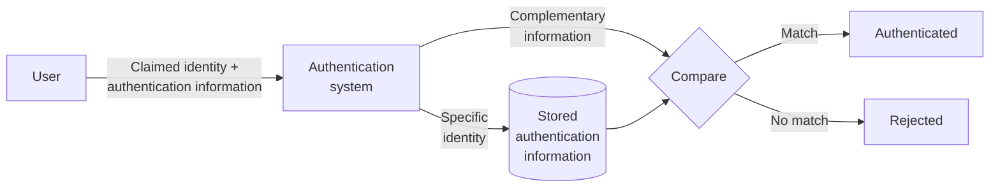
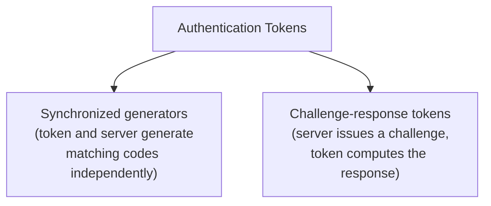
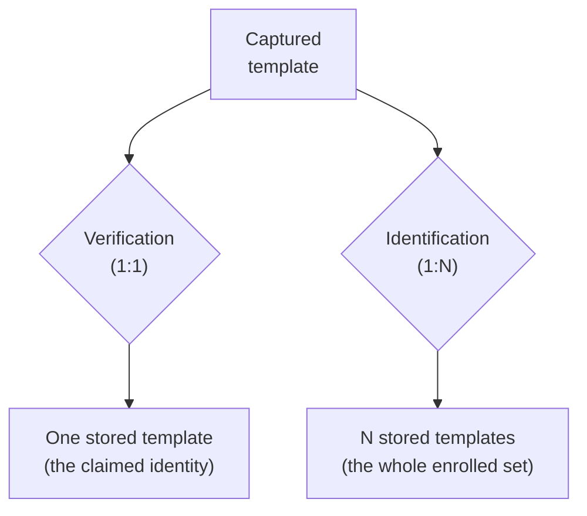

### Table of Contents
- [[#Authentication vs Authorization|Authentication vs Authorization]]
- [[#Session Management|Session Management]]
- [[#User Authentication|User Authentication]]
- [[#Authentication Mechanism|Authentication Mechanism]]
- [[#Passwords|Passwords]]
	- [[#Passwords#Attacks on Password Entry|Attacks on Password Entry]]
- [[#Passphrases|Passphrases]]
- [[#Authentication Tokens|Authentication Tokens]]
	- [[#Authentication Tokens#Synchronized Tokens|Synchronized Tokens]]
	- [[#Authentication Tokens#Challenge-Response Tokens|Challenge-Response Tokens]]
- [[#Biometrics|Biometrics]]
- [[#Biometric Systems|Biometric Systems]]
---
## Authentication vs Authorization

**Authentication** is the process of verifying a claimed identity in order to grant system access. It binds a real-world entity to the roles and permissions that already exist inside the system, which is what makes authorization possible in the first place, and it's also what makes full accountability possible, since every logged action can now be traced back to a specific, verified entity.

**Authorization** is a separate question that only makes sense once authentication has already happened: whether a given, already-identified user actually holds the permissions needed to carry out a specific action within the system. Authentication asks "who are you", authorization asks "what are you allowed to do."

## Session Management

The longer a user holds onto system access, the more exposure there is to credential compromise, through session hijacking, an unattended terminal, or outright token theft. Session management exists to bound that exposure: it enforces a limited operational timeframe, set by organizational security policy, after which a session token simply stops being valid.

How tight that timeframe should be depends heavily on what's at stake. A standard application typically enforces an idle timeout somewhere around 30 minutes. A high-security environment, a banking platform or a healthcare system, usually sets that limit far tighter, often 10 minutes or less, specifically to minimize the window an attacker would have to act if a session were ever compromised.

## User Authentication

Establishing the identity of a principal comes down to verifying one or more factors: something the principal _knows_ (a password or a PIN), something they _possess_ (a smart card, a USB token, a mobile phone), a _biological trait_ they carry (a fingerprint, face, voice, or retina scan), a _physical action_ they perform (a signature), or a _behavioural pattern_ unique to them. In practice, these factors are very often combined rather than used alone, a VISA card paired with a PIN combines possession and knowledge, a smartphone unlocked with a fingerprint combines possession and biology. Combining independent factors like this is exactly what multi-factor authentication means.

## Authentication Mechanism

Actually creating a credential means binding a user's identity to some piece of baseline verification data, and that data has to be stored somewhere, an authentication database. This immediately raises a problem: storing the raw secret itself, a plaintext password, an unencrypted biometric fingerprint file, is a severe vulnerability, since anyone who gains unauthorized access to that file compromises the credential directly, and with it, full system access.

The fix, used by systems like Unix, is to never store the actual secret at all. Instead, the system runs the credential through a one-way cryptographic hash function and stores only the resulting hash. A login attempt is then verified by hashing the newly submitted credential and comparing the two hash values, so the system can confirm a match without ever storing, or even needing to know, the original secret itself.

This is the general shape every authentication mechanism follows, regardless of which factor is being checked:

The user submits a claimed identity together with authentication information (a password, a hash, a scanned fingerprint). The system looks up the stored authentication information tied to that claimed identity, computes the appropriate complementary value from what was just submitted, and compares the two. A match authenticates the user; anything else is rejected. This is the general model of authentication, and it's exactly why the hashing scheme above works: the "stored authentication information" is simply the hash, not the secret itself.

## Passwords

A single password remains the most common way to authenticate, largely because it's simple, familiar to users, and cheap to implement, it needs no specialized hardware at all. But that convenience comes with a structural weakness: the system grants access to anyone who supplies the correct secret, with no way to verify that the person typing it is actually who they claim to be. Robust password security tries to compensate for this on three fronts at once: passwords need to be long (generally more than 12 characters) to resist brute-force search, complex enough to resist dictionary and guessing attacks, and unique across every platform, so that one leaked password doesn't compromise every other account reusing it. Meeting all three at once is a genuinely heavy cognitive burden, since it effectively asks users to memorize a large number of long, unrelated, complex secrets.

### Attacks on Password Entry

Even a strong password can be captured at the point of entry rather than broken mathematically. Physical observation is the simplest case: shoulder surfing at a public terminal, a payment kiosk, or over someone's shoulder at their phone, which really only has a physical defense, deliberately shielding the keystrokes as they're typed.

Over a network, a password can be captured in transit by a packet sniffer if it isn't properly protected; One-Time Passwords (covered below) are one common way to blunt this risk, since an intercepted password stops being useful the moment it's already been used. Locally, a fake login screen (a Trojan horse) can trick a user into typing their password into something that isn't the real operating system prompt at all. The defense here is a **trusted path**: a mechanism guaranteeing the user is genuinely talking to the real OS login prompt and not an imposter. The Ctrl+Alt+Del sequence on Windows exists specifically for this reason, since it's an interrupt only the OS kernel itself can intercept, no ordinary application, malicious or not, is able to capture it.

## Passphrases

A passphrase is built from the same underlying technology as an ordinary password, just using a multi-word sequence instead of a single token. Designing a good passphrase scheme means balancing three separate concerns: usability against security, how easily it can be retained in memory, and how smoothly it can actually be entered.

Length alone pushes security up significantly, but _how_ that length is achieved matters just as much. A passphrase built from ordinary natural-language sentence structure carries meaningfully less entropy than the same number of characters drawn from genuinely random words, since grammar and common phrasing make parts of the sentence predictable, which narrows the space a targeted guessing attack actually has to search. What natural language loses in raw entropy, it gains back in memorability: a sentence-like passphrase is far easier for a person to recall than an equivalent-strength random password. The remaining practical problem is entry, typing a long string is slower and more error-prone than typing a short one, which is why many modern systems tolerate small typographical errors during passphrase entry, trading a sliver of strict precision for a real gain in usability.

## Authentication Tokens

An authentication token is a physical device used to generate a One-Time Password (OTP), a code valid for only a single use, which makes it useless to an attacker who intercepts it after the fact. Tokens come in two general families.

### Synchronized Tokens

A synchronized token and the authentication server both run the same pseudo-random generator algorithm, seeded with the same shared secret, and typically combine that seed with the current time to produce a new passcode every so often. Because both sides compute independently rather than communicating directly, this scheme is sensitive to **clock drift**: if the token's internal clock and the server's fall out of alignment, the codes each side computes can stop matching even though nothing is actually wrong with the secret itself.

The deeper risk is that the whole scheme is deterministic: the output is entirely a function of the seed and the time, so anyone who obtains the seed can reproduce the token's output independently, without ever touching the physical device. This is exactly what happened in the 2011 RSA SecurID breach, where leaked seed values let attackers compute valid codes on their own, undermining the security of every token derived from those seeds.

### Challenge-Response Tokens

A challenge-response token works differently: rather than generating codes on a fixed schedule, the server issues a unique challenge, and the user feeds that challenge into the token, which computes a response using its own secret key. Only a token holding the correct key can produce the response the server expects. Since the challenge itself is fresh and unpredictable each time, this approach isn't vulnerable to the same passive replay risk as a captured one-time code, but it does still depend on the token's secret key staying confidential, exactly the same weak point that undermined synchronized tokens in the SecurID case.

## Biometrics

Biometrics authenticate people by measuring something about them directly, rather than something they know or carry. This can be an aspect of individual anatomy or physiology (hand geometry, a fingerprint), a deeply ingrained skill or behavioural characteristic (a handwritten signature), or a trait that's really a blend of both (voice, which carries both physical and behavioural information at once).

## Biometric Systems

Biometric systems support three distinct kinds of operation, and it's worth keeping them separate, since they answer genuinely different questions even though they all rely on the same underlying captured trait.

**Enrollment** works just like registration in any other authentication system: a user's biometric trait is captured and stored as a reference template, the baseline everything else gets compared against later.

**Verification** is biometric authentication proper, and it answers a narrow question: is this person who they claim to be? It performs a **1:1 match**, comparing one freshly captured template against the one specific stored template tied to the identity being claimed.

**Identification** answers a broader question instead: who is this person, out of everyone enrolled? It performs a **1:N match**, comparing one freshly captured template against N stored templates, potentially the entire enrolled population, searching for whichever one it matches.

Verification is inherently the cheaper and more accurate operation, since it only ever has to resolve one comparison. Identification has to search across every enrolled template, which is both more computationally expensive and more prone to error as N grows, since a false match against any one of N templates is enough to produce a wrong result.

---

