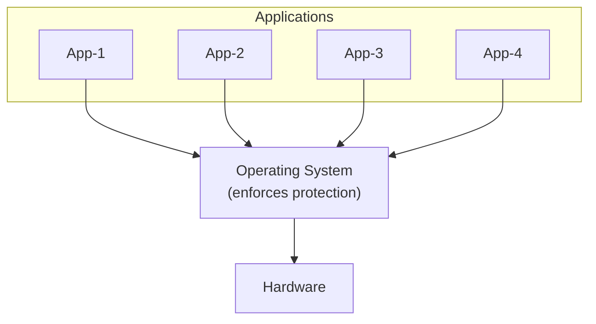
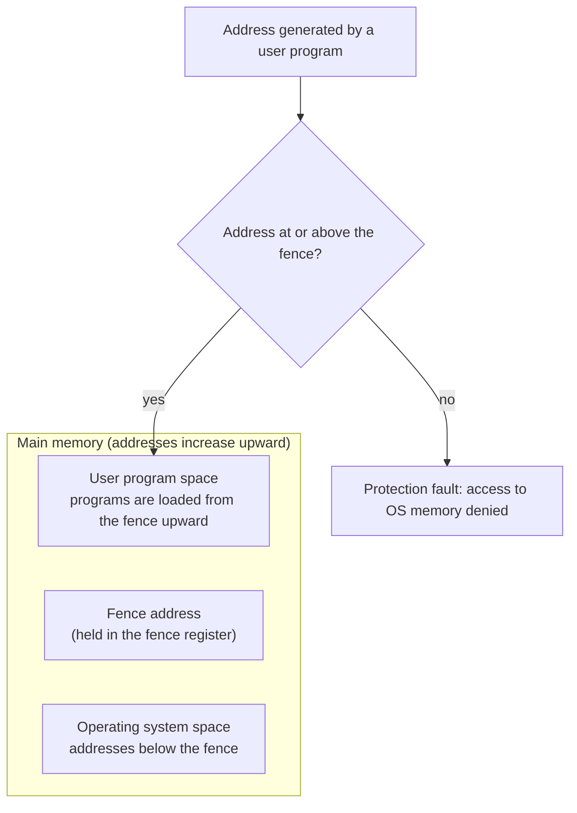
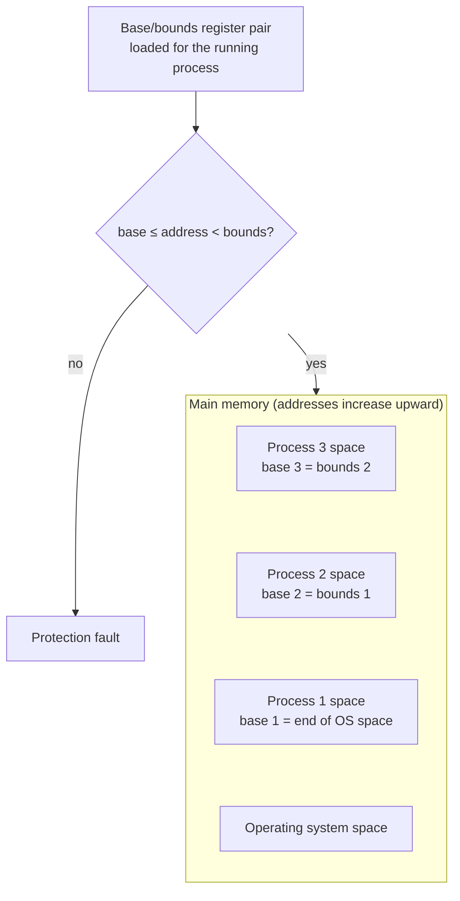
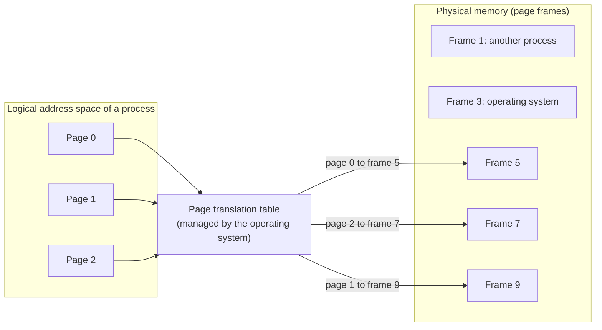
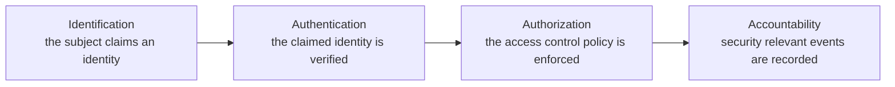
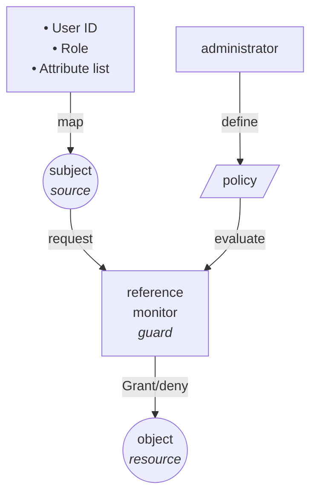

### Table of Contents
- [[#The Role of the Operating System in Protection|The Role of the Operating System in Protection]]
- [[#Separation of Subjects and Objects|Separation of Subjects and Objects]]
- [[#Principles of Protection|Principles of Protection]]
- [[#Memory and Address Space Protection|Memory and Address Space Protection]]
	- [[#Memory and Address Space Protection#Fence|Fence]]
	- [[#Memory and Address Space Protection#Base and Bounds Registers|Base and Bounds Registers]]
	- [[#Memory and Address Space Protection#Paging|Paging]]
- [[#The Classic View of Security|The Classic View of Security]]
- [[#The Access Control Model|The Access Control Model]]
	- [[#The Access Control Model#Reference Monitors in Distributed Systems|Reference Monitors in Distributed Systems]]
	- [[#The Access Control Model#Access Control Architecture|Access Control Architecture]]
- [[#Mapping Subjects to Permissions|Mapping Subjects to Permissions]]
- [[#Representing Access Rights|Representing Access Rights]]
	- [[#Representing Access Rights#The Access Control Matrix|The Access Control Matrix]]
	- [[#Representing Access Rights#Access Control Lists|Access Control Lists]]
	- [[#Representing Access Rights#Capabilities|Capabilities]]
- [[#Security Policies|Security Policies]]
	- [[#Security Policies#Military Access Control Policies|Military Access Control Policies]]
	- [[#Security Policies#Bell and LaPadula Multilevel Security|Bell and LaPadula Multilevel Security]]
	- [[#Security Policies#Biba Integrity Model|Biba Integrity Model]]
	- [[#Security Policies#Chinese Wall Model|Chinese Wall Model]]
- [[#Role Based Access Control|Role Based Access Control]]
	- [[#Role Based Access Control#Common RBAC Concepts|Common RBAC Concepts]]
	- [[#Role Based Access Control#RBAC Rules|RBAC Rules]]
	- [[#Role Based Access Control#RBAC96|RBAC96]]
- [[#Attribute Based Access Control|Attribute Based Access Control]]
	- [[#Attribute Based Access Control#Assertions and Credentials|Assertions and Credentials]]
	- [[#Attribute Based Access Control#Digital Signatures|Digital Signatures]]
	- [[#Attribute Based Access Control#Sources of Assertions|Sources of Assertions]]
	- [[#Attribute Based Access Control#Monotonicity of Assertions|Monotonicity of Assertions]]
	- [[#Attribute Based Access Control#ABAC in Practice|ABAC in Practice]]
- [[#Worked Example: Choosing an Access Control Model|Worked Example: Choosing an Access Control Model]]
- [[#Authorization with JSON Web Tokens|Authorization with JSON Web Tokens]]
---
# Protection and Access Control in Operating Systems

## The Role of the Operating System in Protection

The operating system sits between applications and hardware, and for this reason it implements the fundamental security mechanisms of a computing system. Applications never reach the hardware directly. Every request for memory, storage, or device access passes through the operating system, which makes it the natural place to decide which application may use which resource and in what manner.

The resources that require protection fall into several groups. Memory must be protected so that one program cannot read or corrupt the memory of another program or of the operating system. Sharable I/O devices, such as disks and network interfaces, are used by many processes at the same time and need controlled access. Serially reusable I/O devices, such as printers and tape drives, are used by one process at a time and must be cleanly handed over from one user to the next. Shared programs and sub-procedures, which are offered as services, need protection from unauthorized use and modification. Finally, shared data such as files and databases must be protected against disclosure and corruption.

## Separation of Subjects and Objects

Separation of the subjects that act on a system from the objects they act on forms the basis of most protection mechanisms. Processes may have different security requirements, and separation is the means by which those requirements are kept from interfering with one another. Four forms of separation can be distinguished.

Physical separation gives different processes different physical objects, so that they run on separate hardware. Temporal separation lets processes with different security requirements execute at different times, so that they never coexist on the same resource. Logical separation is provided by the operating system, which creates the illusion for each process that it has the machine to itself, even though the physical resources are shared. Cryptographic separation allows processes to conceal their data and computations in a way that makes them unintelligible to other processes. This is most commonly achieved by encrypting data, and some algorithms even permit computation directly on encrypted data, a technique known as homomorphic encryption.

## Principles of Protection

Protection can be applied at several levels of strength, and the appropriate level depends on how much sharing is required. The weakest level applies no protection at all, which is acceptable only when physical or temporal separation already guarantees that processes cannot affect one another. A stronger approach is isolation, in which processes are entirely unaware of the existence of other processes, as is the case with virtual machines.

Between these extremes lies the choice of sharing everything or sharing nothing, where every object is either public or private. Selective sharing refines this by allowing objects to be shared through access limitations or through capabilities. Here the operating system enforces a policy that defines how users may share objects. Such policies are either mandatory or discretionary, and they are generally implemented in a reference monitor. The most detailed level is usage control, which limits how an object may be used after access has been granted. This is the typical goal of digital rights management systems, and applications of this kind require support from both hardware and the operating system.

## Memory and Address Space Protection

Memory protection is the most basic protection task of an operating system, and three mechanisms of increasing sophistication illustrate how it is achieved: the fence, base and bounds registers, and paging.

### Fence

The simplest mechanism separates the operating system from user programs by means of a predefined memory address, the fence. The operating system resides in the addresses below the fence, and user programs are loaded from the fence address upward. Programs cannot access memory below the fence, and therefore cannot reach operating system memory. A special fence register makes the mechanism flexible, since it allows the boundary to be moved when memory is reallocated.

### Base and Bounds Registers

The fence protects in one direction only. It keeps user programs out of the operating system, but it does nothing to stop a user program from addressing memory that belongs to another user program placed above it. A pair of base and bounds registers protects in both directions. The base register plays the role of the fence and marks the lowest address the program may use, while the bounds register marks the highest. Each process has its own pair of registers, which protects processes from each other. The bounds of one process may coincide with the base of the next, which is summarized by the saying that one man's bounds is another man's base.

### Paging

Segments of variable size, as used with base and bounds registers, are difficult and expensive to manage. Paging addresses this problem by dividing memory into segments of fixed size, called page frames. Page sizes are typically powers of two between 512 and 4096 bytes. A process sees a logical address space made up of pages, and a page translation table maps each logical page to a physical page frame.

The page translation table defines exactly which memory a process can address, and it is managed by the operating system. This prevents a user process from mapping operating system memory into its own address space. Paging has one notable weakness: memory pages have no logical structure, so data with different security requirements may reside on the same page. This resembles the problem of false sharing, in which unrelated data are affected together because they occupy the same unit of memory.

Paging also brings several security benefits. Address references can be checked for protection at the moment the relevant page is mapped, that is, when it is inserted into the page translation table. Users can share data by sharing physical memory pages, and the access rights do not have to be the same for all users of a shared page. In addition, users cannot access main memory directly. Because of these properties, most current systems implement a paging architecture.

## The Classic View of Security

The classic view of security describes access to a system as a sequence of four stages: identification, authentication, authorization, and accountability. A subject first claims an identity, the system then verifies that claim, the system decides whether the requested operation is permitted, and finally the system records what has happened.

Authentication verifies the claimed identity of a subject. Authorization enforces the access control policy by deciding whether a subject has the right to perform a given operation on a given object. Accountability records security relevant events, so that it is possible to establish afterwards what happened and who did what.

## The Access Control Model

The central idea of the access control model is that the security policy is evaluated every time an object is accessed. A reference monitor mediates all access by subjects to objects. It guards access to each object and interprets the access control policy on behalf of the system. Subjects are the active entities of the model, for example users and processes, while objects are passive entities such as files, devices, and other resources.

A firewall administration interface illustrates how the model applies in practice. Suppose the policy states that only an administrator may access and modify the firewall rules. A person who wants to change a rule must first submit a username and password, which is the authentication step that verifies the claimed identity. The system then maps this verified identity, together with its role or attributes, to a subject. The subject issues a request to modify the rule set, which is the object. The reference monitor intercepts the request and evaluates it against the policy that the administrator has defined. Because the policy grants modification rights to administrators only, the request is granted for an administrator and denied for anyone else. Finally, the change is written to a log, which provides accountability.

### Reference Monitors in Distributed Systems

The reference monitor was originally developed for centralised operating systems. In that setting the policy is enforced by components inside the operating system, it is defined by local system administrators, and it is based on local information. This raises the question of how the concept extends to distributed systems. In a distributed system, resources are hosted on different machines, which may be managed by different local administrators and may belong to different administrative domains. Access control decisions may therefore have to combine several local policies. This calls for federated identity management, federated access control policies, and distributed enforcement of those policies.

### Access Control Architecture

A distributed access control system separates the tasks of the reference monitor into distinct components, as shown in the following architecture.

![[access-control-architecture.png | 600]]

The Policy Enforcement Point (PEP) grants or denies access and thereby carries out the decision that has been made. The Policy Decision Point (PDP) decides whether access should be granted or denied, using the policies recorded in the Policy Store. The Policy Administration Point (PAP) manages the Policy Store by adding, removing, and modifying policies. The Policy Information Point (PIP) provides the information that the PDP needs to reach its decisions. This information includes model parameters, roles, attributes, hierarchies, and constraints, as well as the state of the environment, for example the time of day, whether it falls within normal working hours, and the location of users or resources.

## Mapping Subjects to Permissions

Access control models differ in how they connect a subject to the permissions it holds. Identity Based Access Control grants permissions directly to users. Every user has a unique system identifier (UID), and the identity of the user must be verified through authentication before it is used.

Role Based Access Control grants permissions to roles rather than to individuals. Users are assigned one or more roles, and their identity must again be verified before a role is assumed.

Attribute Based Access Control makes permissions depend on the attributes of a user. Users must prove that they possess these attributes, which are often encoded in certificates. The use of certificates often requires the public key of the user, and the use of a public key certificate implies authentication. In all three approaches, users ultimately have to prove their identity in order to exercise their access rights.

## Representing Access Rights

### The Access Control Matrix

The access control matrix is the most general representation of access rights. It is defined by a set of subjects $S$, which are the active entities of the system, a set of objects $O$, which are the passive entities, and a set of rights $R$, which defines the operations that subjects can perform on objects. The entire matrix is denoted $A$, and it encodes the access rights of all subjects to all objects. The element $a[s,o]$ in row $s$ and column $o$ holds the rights of subject $s$ on object $o$, so that $a[s,o] \in R$. In practice, $A$ is often a sparse matrix, since most subjects have no rights on most objects.

|        | File 1           | File 2    | Process 1                 | Process 2                 |
| ------ | ---------------- | --------- | ------------------------- | ------------------------- |
| User 1 | read, write, own | read      | read, write, execute, own | write                     |
| User 2 | append           | read, own | read                      | read, write, execute, own |

The matrix can be stored by columns or by rows, which leads to access control lists and capabilities respectively.

### Access Control Lists

An access control list (ACL) is associated with every object in the system and consists of pairs of the form subject name and access rights. Access is granted if the subject name appears in the list and its access rights include the requested operation. Otherwise, access is denied. Some ACL systems allow a special default action, either grant or deny. This is useful in combination with negative access rights, where the ACL effectively becomes a list of people to exclude.

Delegation is difficult with ACLs, because it requires the right to modify the list. Questions about access rights are answered asymmetrically. It is easy to determine who may access a particular object, since the list is stored with the object, but it is difficult to determine which objects a particular subject may access, since this requires inspecting the lists of all objects.

### Capabilities

A capability list is associated with every subject in the system and consists of pairs of the form unique object identifier and access rights. Capabilities are used to reference objects, so that an object cannot be addressed without a capability for it. Access is granted if the rights in the capability include the requested operation. Three types of capabilities exist: hardware capabilities, segregated capabilities, and encrypted capabilities.

Capabilities are easy to delegate, since a subject can pass one on to another subject. The asymmetry noted for ACLs is reversed. It is easy to determine which objects a subject may access and in what way, but it is difficult to determine who may access a given object, because that requires finding everyone who holds a capability for it.

## Security Policies

Security policies aim to prevent the disclosure or corruption of sensitive data. They rely on several techniques: controlled access to protected resources, isolation or confinement, separation of functions, and well formed transactions. Separation of functions means, for example, that the person who places an order is not the person who signs the check for it.

Policies fall into two broad classes. Under Mandatory Access Control, the system defines the policies and users have little direct influence over them. The system owns the resources. Under Discretionary Access Control, users define the policies and the system has little direct influence. Here the user owns the resources.

### Military Access Control Policies

Military policies are designed to keep military plans secret, so confidentiality is the primary concern, and the need-to-know principle governs who may see what information. The traditional model is based on physical safes and marked binders. Its formal counterpart is the access control lattice, in which security labels are ordered by a dominance relation.

![[access-control-latice.png | 500]]

### Bell and LaPadula Multilevel Security

The Bell and LaPadula model is a mandatory access control model that separates users with multiple levels of privilege on the same system. In the military setting, security labels are ordered from lowest to highest as unclassified, restricted, confidential, secret, and top secret, written $\text{unclassified} \leq \text{restricted} \leq \text{confidential} \leq \text{secret} \leq \text{top secret}$.

The model rests on a small set of definitions. An object is a passive entity that stores information, and a subject is an active entity that manipulates information. A label identifies the secrecy classification of an object, and a clearance specifies the most secret class of information available to a subject. A permission specifies the operations that a subject may invoke on an object, and the model defines read, write, append, and execute permissions.

The model also relies on the relation of domination. A label or clearance $A$ dominates a label $B$ if a flow of information from $B$ to $A$ is authorized, and this is written $A \geq B$. Two security rules are built on this relation. The simple security condition, known as No Read Up (NRU), states that a subject $s$ may access an object $o$ only if the clearance of $s$ dominates the label of $o$. The $*$-property, known as No Write Down (NWD), states that a subject $s$ may use the content of an object $o_1$ to modify an object $o_2$ only if the label of $o_2$ dominates the label of $o_1$. Together the two rules ensure that information can only flow upward in the lattice.

![[bell-and-lapadula.png | 500]]

*No Read Up (NRU) and No Write Down (NWD)*

**A consequence of the $*$-property is that objects tend to rise slowly towards the highest classification.**

Several implementation issues arise with this model. The first is the unavailability of passive objects, which means that objects must be activated before they are accessed. The system call `open()` is an example of such an activation. The second is the tranquillity principle, which requires that the label of an active object cannot be changed. The third concerns the initialization of objects, whose initial state must not depend on any previously allocated resource, since such a dependency could leak information.

### Biba Integrity Model

In civilian systems, integrity is often more important than secrecy. The Biba model addresses this by defining an integrity model that is similar to the Bell and LaPadula model. It introduces integrity classes and prevents information from objects with low integrity from contaminating objects with higher integrity.

The model has two rules. The simple integrity rule states that a subject $s$ may modify an object $o$ only if the integrity class of $s$ dominates the integrity class of $o$. The confined integrity rule states that a subject $s$ may read the content of an object $o$ only if the integrity class of $o$ dominates the integrity class of $s$. The resulting restrictions are the reverse of those in Bell and LaPadula, namely No Read Down (NRD) and No Write Up (NWU).

![[biba-integrity-model.png | 500]]

*No Read Down (NRD) and No Write Up (NWU)*

### Chinese Wall Model

The Chinese Wall model was developed to avoid conflicts of interest among consultants. A consultancy firm divides its clients into business areas, and each consultant may work for several clients. A priori, no limitations are assumed, but a consultant is allowed to work for only one client in each business area. In this way a consultant cannot hold confidential information from two competing clients.

![[chinese-wall.png | 600]]

## Role Based Access Control

In many cases, authorization should be based on the function, or role, of the subject in the manipulation of the object. Consider an accountant, Anne, who works for DTU Compute and has access to financial records. When she leaves and Eva is hired as the new accountant, Eva must receive access to the same records. With identity based permissions, all the necessary permissions have to be transferred individually from Anne to Eva. If permissions are attached to the role of accountant instead, it suffices to assign Eva to that role.

Functional roles are found in every organization. A bank has tellers, financial advisors, branch managers, regional managers, and a bank director. A hospital has doctors, such as general practitioners, consultants, and treating doctors, as well as nurses, such as ward nurses, and hospital administrators. A university has academics, such as teachers and research fellows, non-academic staff, such as secretaries and system administrators, and students.

### Common RBAC Concepts

The formal treatment of RBAC uses a small vocabulary. The active role of a subject $s$ is written $AR(s)$, and it is the role that the subject is currently using. The set of roles that a subject is allowed to assume is the set of authorized roles, written $RA(s)$. The set of transactions that a role may perform is the set of authorized transactions, written $TA(r)$ for a role $r$. The predicate $exec(s, t)$ is true if and only if subject $s$ can execute transaction $t$. A session binds a user to a set of currently activated roles.

### RBAC Rules

Three rules define the behavior of an RBAC system. The role assignment rule states that a subject can only execute a transaction if it has selected a role.

$$\forall s : \text{subject}, t : \text{transaction} \; (\text{exec}(s, t) \Rightarrow \text{AR}(s) \neq \varnothing)$$

The role authorization rule states that the active role of a subject must be authorized for that subject.

$$\forall s : \text{subject} \; (\text{AR}(s) \subseteq \text{RA}(s))$$

The transaction authorization rule states that a subject can only execute a transaction if the transaction is authorized for the subject's active role.

$$\forall s : \text{subject}, t : \text{transaction} \; (\text{exec}(s, t) \Rightarrow t \in \text{TA}(\text{AR}(s)))$$

### RBAC96

Role Based Access Control was initially defined by Ferraiolo and Kuhn of NIST in 1992. A family of related RBAC models was defined by Sandhu and colleagues in 1996, and this family is commonly known as RBAC96. It forms the basis for most of the continued work on role based access control. RBAC96 defines the following models.

![[rbac96.png | 500 ]]

![[rbac.png | 600]]

## Attribute Based Access Control

Attribute Based Access Control (ABAC) decides whether an operation is allowed on the basis of attributes, which are facts about the entities involved in a request. These entities are the subject or agent making the request, the object or resource being accessed, the action or operation requested, and sometimes the environment, such as the context or the time.

KeyNote is a trust management system that implements ABAC by means of assertions, which are digital statements. It is specified in RFC 2704 and was developed by Blaze, Feigenbaum, Ioannidis, and Keromytis in 1999.

### Assertions and Credentials

An assertion is a digitally signed statement with two parts. The first part identifies an agent, meaning the party to whom the statement refers, which is often a public key or an identity. An example is the statement that the key K_Alice belongs to Alice. The second part specifies an allowed operation, that is, what the agent is permitted to do. An example is the statement that K_Alice may read File_X. Assertions of this kind act as digital credentials or policies.

### Digital Signatures

Each assertion is digitally signed by its issuer, which ensures its authenticity and integrity. The issuer may be the system administrator or another authority, in which case the assertion expresses policy, or it may be the agent itself, in which case it is a self-asserted credential. The signature ensures that no one can forge or alter the assertion.

### Sources of Assertions

Assertions come from two sources. The system supplies assertions that express its security policy, for example the statement that any user with a key signed by the administrator can access internal files. Agents supply their own credentials, for example the statement that Alice's key carries the administrator's signature, which allows her to access the database. Permissions can therefore be given directly and explicitly, or indirectly through linked assertions. An operation is allowed if there exists an assertion that permits it, either as explicit permission from the issuer or implicitly through other assertions from the same issuer. The implicit case requires an inference engine to derive new assertions from existing ones.

### Monotonicity of Assertions

Assertions in ABAC are monotonic. Adding an assertion never disallows an operation, and deleting an assertion never allows a prohibited operation. Everything is prohibited unless it is explicitly allowed.

This property has important consequences. It makes the approach safe to use in distributed systems, because lost assertions cannot break a policy. It also supports proof based authorization, in which the set of assertions that combine to allow an operation constitutes a proof that the security policy is enforced. Clients may collect signed assertions and send them to the server, which offloads work from the server to the clients. Finally, no conflicts are possible, since an operation that can be allowed on the basis of the system's assertions will always be allowed.

### ABAC in Practice

ABAC is well suited to large distributed systems because it allows decentralized specification of security policies and decentralized, autonomous enforcement of them. It gives permission and the justification for allowing an operation at the same time, since the set of assertions used to authorize the operation serves as the justification. It also allows security policies to evolve dynamically, because adding new assertions may add new users, roles, permissions, or resources. One limitation is that it is not obvious how context can be encoded in assertions, and this is a potential obstacle to its application in pervasive computing environments.

## Worked Example: Choosing an Access Control Model

The following exercise applies the models discussed above. DTU uses an access control system to manage access to its digital resources. The users are students, faculty, and administrators, and the resources include grades, course materials, and an admin panel. Different departments, such as Computer Science and Physics, and contextual conditions, such as time and location, may also affect access. DTU wants each user to access only what is permitted to them, and it wants access to be controllable on the basis of roles, individual identities, and attributes such as department or time. The university decides that professors can upload grades and course materials, that students can view only their own grades and materials, and that access to the system is denied outside university hours, which are 8 AM to 8 PM.

The question is which access control model best represents this policy. Four answers are offered. The first is Identity Based Access Control, on the grounds that permissions are tied to specific users. The second is Role Based Access Control, because permissions depend on roles such as professor and student. The third is Attribute Based Access Control, because the system considers attributes such as department and time of access. The fourth is a combination of RBAC and ABAC, because access depends on both user roles and environmental conditions such as time.

The best answer is Attribute Based Access Control. The fourth option may seem intuitively correct because it mentions both roles and time, but standard security models define ABAC as a general framework in which the decision evaluates attributes of the subject, the resource, and the environment. The subject attributes include role, department, and identity. The resource attributes identify grades, course materials, and the admin panel. The environmental attributes include the time of day and the location. RBAC can be implemented as a special case of ABAC, in which the role is simply treated as one subject attribute alongside environmental attributes such as time. The overarching model that covers user attributes, resource attributes, and environmental conditions is therefore ABAC. Neither IBAC nor RBAC alone can express the requirement that students see only their own grades or that access is denied outside university hours.

## Authorization with JSON Web Tokens

JSON Web Tokens (JWT) are widely used by web applications to enforce access control, and they are typically carried in the authorization header of a request. A JWT has the form header.payload.signature and therefore consists of three parts.

The header contains two pieces of information: the type of the token, which is JWT, and the algorithm used for the signature, for example HS256. The payload carries the claims and can contain various kinds of information. Registered claims include the issuer, expiration time, subject, and audience. Public claims include items such as the name of the user, and private claims include application specific items such as the role. The payload is encoded by default, and it can additionally be encrypted when confidentiality is required. The last part is the signature, usually computed as a HMAC over the encoded header and payload, which allows the receiving server to detect any modification of the token.

![[jwt-tokens.png | 600]]